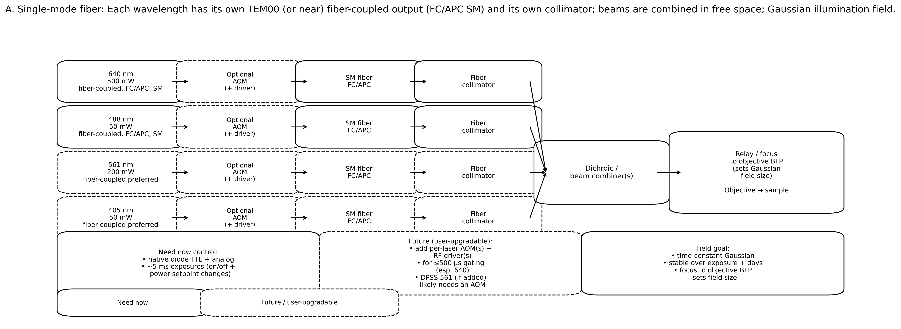
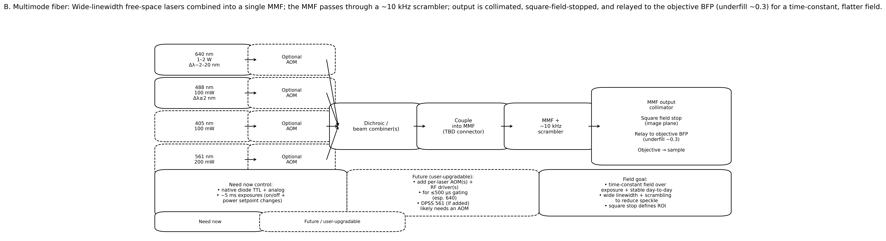

# Draft email: modular, faster-delivery laser options (Approach A vs B)

> **Editing note:** **the email can be trivially shortened (while keeping the tables + questions intact)** by deleting the sections **“Background / funding constraint”** and **“Rationale / context”** and keeping everything from **“Diagrams + quote tables + questions”** onward.

---

## Email draft (copy/paste)

**To:** Ori Linenberg (Roshel Electroptics) <ori@roshelop.co.il>; CNI sales / Demi Zhang <trade@cnilaser.com>  
**Cc:** (optional) Gennadi <gennadi@roshelop.co.il>  
**Subject (suggested):** Request: faster + more economical modular laser options (SM-fiber vs wide-linewidth MMF) + itemized quote

Hi Ori, hi Demi,

### Background / funding constraint (optional)
Unfortunately, our **US$50,000 departmental equipment grant was not funded**.

I now have **~10 days** to submit a **new grant application (up to US$25,000)**. If awarded, the funds would be available **by the end of this month**.  
Because of this, I’m trying to identify a **more economical laser solution** that can also be **delivered sooner**, ideally by ordering in **modules** (buy the “need-now” core first, then add wavelengths / fast gating add-ons later).

### Rationale / context (optional)
We previously discussed an integrated multi-wavelength engine (e.g., an RGB fiber-coupled system). To reduce both **lead time** and **up-front cost**, I’d like to ask for pricing and feasibility for a **step-by-step modular purchase** based on one of the two concepts below:

- **Approach A (single-mode fibers):** each wavelength is a **TEM00 (or near) source** with its **own SM FC/APC fiber output**, then we **combine beams in free space**.
- **Approach B (wide linewidth + MMF):** use **wide-linewidth free-space lasers** combined into a **single multimode fiber (MMF)** + **~10 kHz scrambler**, then a **square field stop** and relay to the objective.

In both approaches:
- **Need-now priority** is stable illumination + reliable modulation for **~5 ms exposures**.
- **Future add-on** is **≤500 µs gating**, likely via **AOM(s) + RF driver(s)** (especially for 640 nm and DPSS 561 nm).

### What I’m asking for
1) Please provide an **itemized quote** and **lead time** for the “need-now” items, and **separately** for the optional “future add-on” items (AOMs / fast modulation modules).  
2) If you see a **lower-cost / faster-delivery variant** of either approach (e.g., different model families, different coupling packages, different connectors), please propose it.

---

## Diagrams + quote tables + questions (keep this section intact)

### Approach A diagram (single-mode fiber, free-space combination)

### Approach B diagram (wide linewidth + multimode fiber + scrambler)

---

## Proposed modular order (so we can start within a ~US$25k envelope)

| Step | What to purchase first | Purpose | Notes / what to quote separately |
|---:|---|---|---|
| 1 | **640 nm “need-now” channel** (Approach A *or* B), incl. basic modulation | Start experiments; validate stability + integration | Quote base laser + PSU; quote coupling hardware; quote any required collimator/cable separately |
| 2 | **488 nm “need-now” channel** | Second wavelength for core workflows | Quote as an add-on module compatible with Step 1 optics/fiber choice |
| 3 | **Optional AOM(s) + RF driver(s)** (esp. 640; DPSS 561 if added) | Enable ≤500 µs gating / cleaner waveforms | Please itemize AOM hardware, RF driver, expected rise/fall/switch time |
| 4 | **561 nm (future)** | Additional channel | DPSS likely; please advise if AOM is effectively required |
| 5 | **405 nm (future)** | Additional channel | Quote as optional add-on |

---

## Approach A: itemized quote checklist (Single-mode fiber per wavelength)

| Item | Need | Target spec | Questions for quote |
|---|---|---|---|
| Laser **640 nm** | need now | ~500 mW, **TEM00 / near**, **fiber-coupled SM**, FC/APC | Model options; price; lead time; **fiber output power spec**; polarization; stability; TTL/analog bandwidth + rise/fall; recommended connector + patch cord |
| Laser **488 nm** | need now | ~50 mW, **TEM00 / near**, **fiber-coupled SM**, FC/APC | Same as above |
| Laser **561 nm** | future | ~200 mW, TEM00 preferred, fiber-coupled preferred | If DPSS: do you recommend an external AOM for fast gating and stable output control? |
| Laser **405 nm** | future | ~50 mW, TEM00 preferred, fiber-coupled preferred | Availability + lead time |
| FC/APC **SM patch cords** | need now | Length options (e.g., 1–2 m) | Do you supply patch cords? What SM fiber type / MFD? |
| **Fiber collimators** (FC/APC) | need now | Choose focal length / beam diameter | Do you supply matching collimators? Recommended beam diameters for downstream combining? |
| **AOM + RF driver** (optional add-on) | future | per wavelength as needed | Recommended AOM model(s) for 640 and for 561; switching time for ≤500 µs gating; insertion loss; aperture; driver requirements |

---

## Approach B: itemized quote checklist (Wide linewidth lasers → single MMF + scrambler)

| Item | Need | Target spec | Questions for quote |
|---|---|---|---|
| Laser **640 nm** | need now | **1–2 W**, **wide linewidth** (Δλ ~2–20 nm), free-space | Confirm achievable linewidth range + how specified; price; lead time; modulation options; beam parameters for efficient MMF coupling |
| Laser **488 nm** | need now | ~100 mW, linewidth ≥ ~2 nm, free-space | Same as above |
| Laser **405 nm** | future | ~100 mW, free-space | Availability + lead time |
| Laser **561 nm** | future | ~200 mW, DPSS likely | If DPSS: is AOM effectively required for clean gating? |
| **Combining optics** | need now | dichroics / combiners | Can CNI provide recommended dichroics/combiner approach for these wavelengths? |
| **MMF coupling package** | need now | coupling into MMF (connector TBD) | Do you offer a coupling package into MMF? Recommended **MMF core/NA/connector** (FC/PC, SMA, etc.) |
| **MMF scrambler** | need now | ~10 kHz class | Any recommended scrambler compatible with your MMF launch/coupler? |
| **MMF output collimator + square field stop** | need now | define uniform square ROI | Recommended optics for stable, repeatable alignment; what beam diameter / NA should we target into the objective BFP (underfill ~0.3)? |
| **AOM + RF driver** (optional add-on) | future | per wavelength as needed | Same as Approach A; please quote separately |

---

## Consolidated questions for CNI (please answer + quote where applicable)

1) **Which CNI models** match the wavelength/power targets above for each approach?  
2) For each proposed model: **linewidth (nm)**, **beam quality (M² / TEM00)**, polarization, and **long-term power stability** (and what “<X%” means / over what time).  
3) **Modulation:** TTL/analog inputs supported, bandwidth, rise/fall times; whether you recommend external AOM for **≤500 µs** gating (especially 640 and DPSS 561).  
4) **Fiber coupling options:**  
   - Approach A: FC/APC **single-mode fiber outputs** (including recommended fiber type / MFD / length).  
   - Approach B: MMF coupling package + recommended MMF specs (core/NA/connector) and coupling tolerances.  
5) **Lead time and shipping:** lead time per line item; fastest-delivery alternatives; typical shipping time to Weizmann (Israel).  
6) **Itemization:** please separate pricing for: base laser + PSU; fiber coupling (if any); modulation option; AOM + RF driver; any required cooling; and any alignment/coupling service.

---

Warmly,  
Yossi / Joseph Steinberger  
Weizmann Institute of Science

MD