<!--
AUTO-GENERATED FILE. DO NOT EDIT DIRECTLY.
Source: notebooks/14_stepindex_mmf_spectral_linewidth_physics.py
Generated by: scripts/export_notebooks_markdown.py
-->

# Step-index MMF + spectral linewidth

This notebook is meant to be a **single place** where you can build real intuition for:

- why a **step-index multimode fiber (MMF)** can create a **very small** spectral correlation width
  (often **~0.01 nm scale** for meter-scale fibers), and therefore
- why a **few-nm instantaneous linewidth** can average **many effectively independent** speckle patterns
  *within a single short exposure* (e.g. 500 μs).

It merges two kinds of content into one read-through:

1) **SVG “whiteboard diagrams”** (tracked in the repo under `docs/figures/`).
2) **Python-generated plots + toy simulations**, including a small **interactive slider**.

Companion files:

- `docs/MEETING_PREP_LASER_STAFF_SCIENTIST.md` (one-page chain + questions)
- `notebooks/13_cni_2nm_stepindex_spectral_diversity_500us.py` (scenario sweeps)

---

## What you should get from this notebook

1. A defensible derivation chain:

   $$
   \theta_{\max}\;\Rightarrow\;\Delta\mathrm{OPL}\;\Rightarrow\;\Delta\lambda_c\;\Rightarrow\;N_{\lambda}\;\Rightarrow\;C.
   $$

2. A *discrete* picture for the key confusion:

   > “Why can two narrow spikes separated by **0.01 nm** produce **uncorrelated** speckle?”

3. Multiple views of the same idea (ray picture, phase-vs-λ picture, correlation-vs-δλ picture, toy speckle simulation).

4. Practical “meeting-ready” numbers: what changes when you change **L**, **NA**, **n**, and “how graded-index it is”.

## 0) Imports + repo plumbing

Notes:

- These notebooks are tracked as **Jupytext percent** (`*.py`). You can convert to `ipynb` locally.
- This repo keeps **binary outputs** out of git; the notebook should be executed locally and exported to HTML/PDF for printing.

<details>
<summary>Code cell 1</summary>

```python
from __future__ import annotations

import math
import sys
from pathlib import Path

import matplotlib
import matplotlib.pyplot as plt
import numpy as np
import pandas as pd

# Plotly is used for one interactive slider-based visualization.
import plotly.graph_objects as go
import plotly.io as pio
from plotly.subplots import make_subplots

# If we are in a notebook, prefer inline backend.
if "ipykernel" in sys.modules:
    try:
        if matplotlib.get_backend().lower() == "agg":
            matplotlib.use("module://matplotlib_inline.backend_inline", force=True)
    except Exception:
        pass


def find_repo_root(start: Path) -> Path:
    """Find repo root by walking upward until we see (src/, environment.yml)."""
    p = start.resolve()
    for parent in [p, *p.parents]:
        if (parent / "src").is_dir() and (parent / "environment.yml").exists():
            return parent
    return p


REPO_ROOT = find_repo_root(Path.cwd())
if str(REPO_ROOT) not in sys.path:
    sys.path.insert(0, str(REPO_ROOT))

FIG_DIR = REPO_ROOT / "docs" / "figures"

from src.mmf_fiber_speckle import (  # noqa: E402
    MultimodeFiber,
    max_guided_meridional_ray_angle_rad,
    optical_path_spread_geometric_step_index_m,
    speckle_spectral_corr_width_nm,
)
from src.speckle_weighting import effective_n_from_weights  # noqa: E402
from src.temporal_coherence import (  # noqa: E402
    coherence_length_m_from_linewidth_nm,
    coherence_time_s_from_linewidth_nm,
    delta_nu_hz_from_delta_lambda_nm,
)

# Toy speckle generator: disk-basis "modes" used elsewhere in this repo.
from src.fiber_modes import (  # noqa: E402
    disk_mode_indices,
    intensity_from_field,
    make_core_grid,
    precompute_mode_stack,
    random_complex_coeffs,
    speckle_contrast,
    superpose_modes,
)

plt.rcParams.update({"figure.figsize": (7.8, 4.6), "figure.dpi": 120})

# Plotly renderer: choose what works in your setup.
# Good defaults:
#   "vscode" (VS Code), "notebook" (classic), "jupyterlab", or "browser".
# We keep it explicit but do not force a value.
pio.renderers.default = pio.renderers.default
```

</details>

## 1) Configuration (meeting defaults)

We keep numbers aligned with notebook 13:

- Center wavelength: 640 nm
- Fiber: 400 μm core, NA=0.22, length=3 m, silica-like index ~1.46
- Example linewidths / separations: 0.002–20 nm

Important distinction:

- **Δλ_src** in the speckle-averaging model means the **instantaneous** spectral span present *within one exposure*.
- An OSA “2–3 nm” measurement can be **time-averaged**; that can be irrelevant if the source is narrow on 500 μs timescales.

<details>
<summary>Code cell 2</summary>

```python
lambda0_nm = 640.0

fiber = MultimodeFiber(
    core_diameter_um=400.0,
    na=0.22,
    length_m=3.0,
    n_core=1.46,
    modal_delay_scale=1.0,  # 1.0 = step-index-like upper bound; <<1 = more graded-index-like
)

# A few example wavelength separations / spans.
linewidth_examples_nm = [0.002, 0.005, 0.008, 0.01, 0.02, 0.1, 0.5, 2.0, 5.0, 20.0]

pd.DataFrame(
    [
        {
            "λ0_nm": lambda0_nm,
            "L_m": fiber.length_m,
            "NA": fiber.na,
            "n_core": fiber.n_core,
            "modal_delay_scale": fiber.modal_delay_scale,
        }
    ]
)
```

</details>

## 2) The chain (as diagrams)

These SVG figures are tracked under `docs/figures/` (text-only assets).
They are embedded here so the notebook can be exported to HTML for printing.

### 2.1 Fiber NA → internal angle

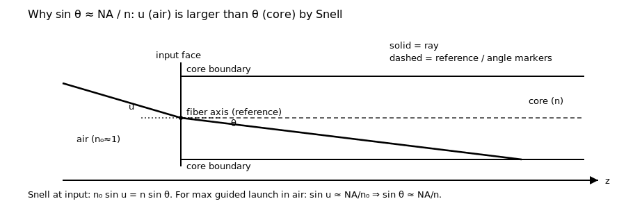

### 2.2 Internal angle → optical-path spread

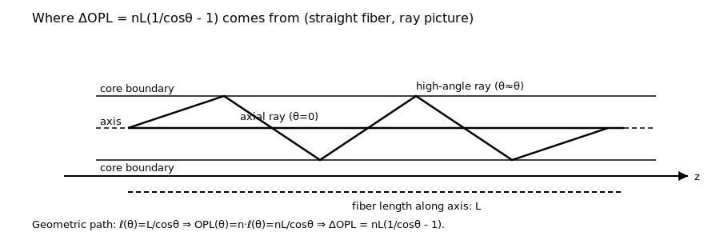

### 2.3 Optical-path spread → spectral decorrelation width

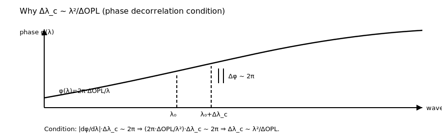

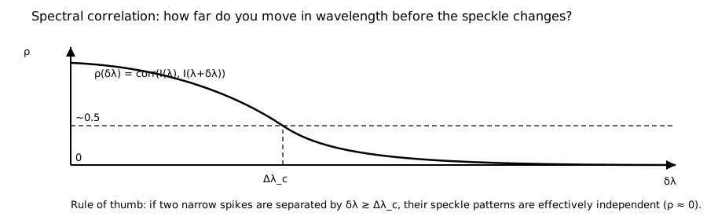

### 2.4 The discrete “two spikes” picture

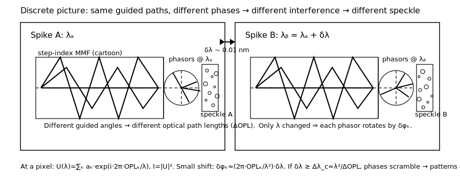

Another view: a wavelength shift creates a **phase ramp** across the mode delay spread.

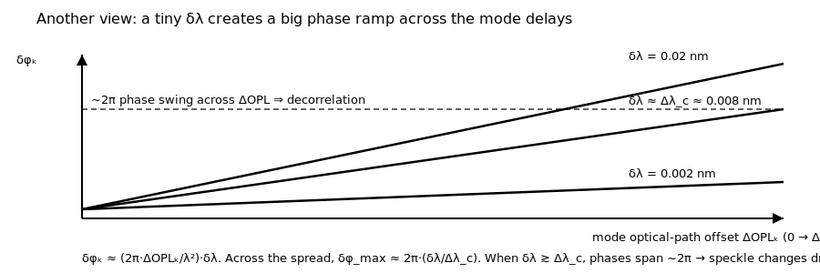

### 2.5 Scaling summary (what changes when you change L, NA, n, step-index-ness)

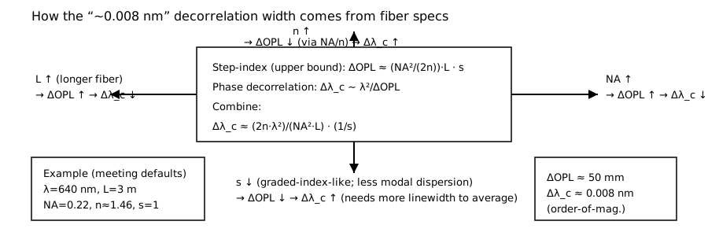

### 2.6 Contrast vs number of independent spectral bins

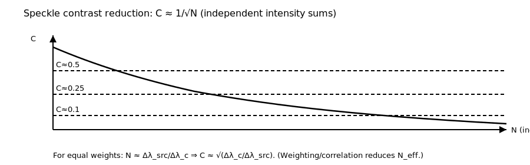

### 2.7 Linewidth ↔ coherence length (useful sanity check)

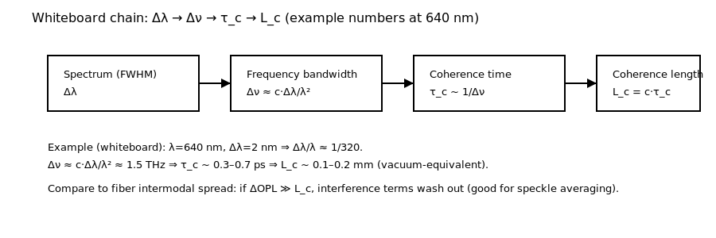

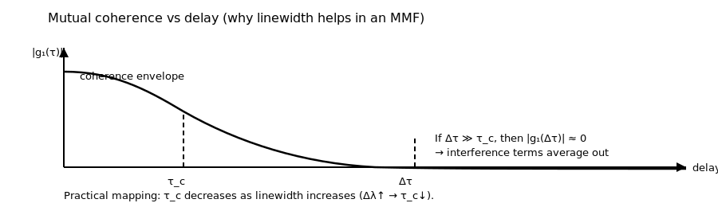

### 2.8 Step-index vs graded-index intuition

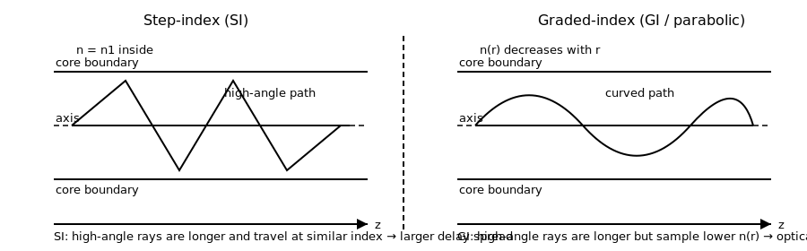

## 3) Symbol table (so we stop getting lost)

This notebook uses a small number of “load-bearing” symbols. Here is a quick reference.

| Symbol | Meaning | Typical value here | Units |
|---|---|---:|---|
| $\lambda$ | Wavelength | 640 | nm |
| $\delta\lambda$ | Separation between two narrow spectral spikes | 0.01 | nm |
| $\Delta\lambda_{\mathrm{src}}$ | Instantaneous spectral span present during one exposure | 2–5 | nm |
| $\mathrm{NA}$ | Fiber numerical aperture (guidance) | 0.22 | (unitless) |
| $n$ | Core index (effective) | 1.46 | (unitless) |
| $L$ | Fiber length | 3 | m |
| $\theta_{\max}$ | Max guided *internal* ray angle in core | ~9 | deg |
| $\Delta\mathrm{OPL}$ | Intermodal optical-path *spread* (vacuum-equivalent) | ~0.05 | m |
| $\Delta\tau$ | Intermodal group delay spread | ~170 | ps |
| $\Delta\lambda_c$ | Speckle spectral correlation width | ~0.008 | nm |
| $N_\lambda$ | # of (effectively) independent spectral speckle patterns in the exposure | ~250 for 2 nm | (unitless) |
| $C$ | Speckle contrast (RMS/mean) | ~0.06 (optimistic) | (unitless) |

A note on “$\Delta$” vs “$\delta$”:

- $\delta\lambda$ is often used as a variable “offset” (e.g. the separation between two spikes).
- $\Delta\lambda_c$ is the **characteristic** width that makes the correlation drop (a property of the fiber).

## 4) Step 1: why $\sin\theta_{\max}\approx \mathrm{NA}/n$?

This is a common point of confusion, because “fiber NA” is usually introduced as an **external** acceptance cone in air.

**Definitions (step-index, weak guidance):**

$$
\mathrm{NA} \equiv \sqrt{n_{\mathrm{core}}^2 - n_{\mathrm{clad}}^2}.
$$

A standard result is that the **external** half-angle in air $u_{\max}$ satisfies:

$$
\sin u_{\max} \approx \mathrm{NA}.
$$

At the input face, Snell’s law links external angle $u$ and internal core angle $\theta$:

$$
n_0\sin u = n_{\mathrm{core}}\sin\theta.
$$

Taking $n_0\approx 1$ (air) and $u=u_{\max}$:

$$
\sin\theta_{\max} \approx \frac{\mathrm{NA}}{n_{\mathrm{core}}},\qquad
\theta_{\max}=\arcsin\!\left(\frac{\mathrm{NA}}{n_{\mathrm{core}}}\right).
$$

Why we care: the axial projection is $\cos\theta$, and the optical path goes like $1/\cos\theta$.

<details>
<summary>Code cell 3</summary>

```python
theta_max_rad = max_guided_meridional_ray_angle_rad(na=fiber.na, n_core=fiber.n_core)
theta_max_deg = theta_max_rad * 180.0 / math.pi

pd.DataFrame(
    [
        {
            "NA": fiber.na,
            "n_core": fiber.n_core,
            "theta_max_deg (internal)": theta_max_deg,
            "sin(theta_max)": math.sin(theta_max_rad),
            "NA/n": fiber.na / fiber.n_core,
        }
    ]
)
```

</details>

## 5) Step 2: where does $\Delta\mathrm{OPL}\approx (\mathrm{NA}^2/(2n))\,L$ come from?

**Start with geometry.** For a straight fiber, think of two limiting meridional rays:

- an axial ray ($\theta=0$)
- the highest-angle guided ray ($\theta=\theta_{\max}$)

The **geometric path length** is:

$$
\ell(\theta) = \frac{L}{\cos\theta}.
$$

The **optical path length** (OPL) is refractive index times geometric length:

$$
\mathrm{OPL}(\theta)=n\,\ell(\theta)=\frac{nL}{\cos\theta}.
$$

So the spread between the two extremes is:

$$
\Delta\mathrm{OPL} = \mathrm{OPL}(\theta_{\max})-\mathrm{OPL}(0)
= nL\left(\frac{1}{\cos\theta_{\max}}-1\right).
$$

**Small-angle approximation.** If $\theta$ is small, $\cos\theta\approx 1-\theta^2/2$, so:

$$
\frac{1}{\cos\theta}-1 \approx \frac{\theta^2}{2}.
$$

With $\sin\theta\approx\theta$ and $\sin\theta_{\max}\approx \mathrm{NA}/n$:

$$
\Delta\mathrm{OPL} \approx nL\,\frac{\theta_{\max}^2}{2}
\approx nL\,\frac{1}{2}\left(\frac{\mathrm{NA}}{n}\right)^2
= \frac{\mathrm{NA}^2}{2n}\,L.
$$

**Interpretation:**

- Larger **NA** means you guide higher-angle rays/modes → longer zig-zag paths → larger delay spread.
- Longer **L** gives more accumulated delay spread.
- Larger **n** makes the internal angles smaller (for the same NA), reducing the spread.

<details>
<summary>Code cell 4</summary>

```python
# Exact geometric expression using theta_max
opl_spread_exact_m = optical_path_spread_geometric_step_index_m(length_m=fiber.length_m, na=fiber.na, n_core=fiber.n_core)

# Small-angle approximation: ΔOPL ≈ (NA^2/(2n)) L
opl_spread_small_angle_m = (fiber.na * fiber.na) * fiber.length_m / (2.0 * fiber.n_core)

pd.DataFrame(
    [
        {
            "ΔOPL_exact_m": opl_spread_exact_m,
            "ΔOPL_small_angle_m": opl_spread_small_angle_m,
            "ratio_exact/small": opl_spread_exact_m / opl_spread_small_angle_m,
            "ΔOPL_exact_mm": 1e3 * opl_spread_exact_m,
        }
    ]
)
```

</details>

### 5.1 How accurate is the small-angle approximation for NA=0.22?

It matters because the “0.008 nm” number ultimately depends on $\Delta\mathrm{OPL}$.

The good news: for NA≈0.22 in silica, it’s a **few-percent** effect.

<details>
<summary>Code cell 5</summary>

```python
na_grid = np.linspace(0.05, 0.40, 80)
ratios = []
for na in na_grid:
    exact = optical_path_spread_geometric_step_index_m(length_m=fiber.length_m, na=float(na), n_core=fiber.n_core)
    approx = (na * na) * fiber.length_m / (2.0 * fiber.n_core)
    ratios.append(exact / approx)

fig, ax = plt.subplots(figsize=(7.8, 4.2))
ax.plot(na_grid, ratios)
ax.axvline(fiber.na, linestyle="--", alpha=0.6)
ax.set_title("Exact ΔOPL / small-angle ΔOPL vs NA (L fixed)")
ax.set_xlabel("Fiber NA")
ax.set_ylabel("ratio")
ax.grid(True, alpha=0.3)
plt.show()
```

</details>

## 6) Step 3: why $\Delta\lambda_c \sim \lambda^2/\Delta\mathrm{OPL}$?

Here is the “single sentence” physics:

- The speckle pattern depends on **relative phases** between many guided contributions.
- Changing wavelength changes those phases.
- Once the phase differences have shifted by **~2π** across the relevant delay spread, the interference pattern is effectively unrelated.

A standard decorrelation condition is:

$$
\Delta k\,\Delta\mathrm{OPL} \sim 2\pi,\qquad k=2\pi/\lambda.
$$

For a small change $\Delta\lambda$:

$$
\Delta k \approx \left|\frac{\mathrm{d}}{\mathrm{d}\lambda}\left(\frac{2\pi}{\lambda}\right)\right|\Delta\lambda
= \frac{2\pi}{\lambda^2}\,\Delta\lambda.
$$

Plugging into $\Delta k\,\Delta\mathrm{OPL} \sim 2\pi$:

$$
\frac{2\pi}{\lambda^2}\,\Delta\lambda_c\,\Delta\mathrm{OPL} \sim 2\pi
\;\Rightarrow\;
\Delta\lambda_c \sim \frac{\lambda^2}{\Delta\mathrm{OPL}}.
$$

### Key intuition

- Bigger delay spread $\Delta\mathrm{OPL}$ ⇒ you need a *smaller* wavelength change to scramble phases ⇒ smaller $\Delta\lambda_c$.
- This is why **meter-scale step-index MMFs** can easily give **0.01 nm-scale** decorrelation widths.

<details>
<summary>Code cell 6</summary>

```python
dlam_c_nm = speckle_spectral_corr_width_nm(lambda0_nm=lambda0_nm, delta_opl_m=opl_spread_exact_m)

pd.DataFrame(
    [
        {
            "ΔOPL_mm": opl_spread_exact_m * 1e3,
            "Δλ_c_nm": dlam_c_nm,
        }
    ]
)
```

</details>

## 7) The 0.01 nm question (the discrete picture)

You said you want a concrete mental model for:

> “Why do two spikes separated by ~0.01 nm give unrelated speckle?”

A really compact derivation is to look at how much the **relative phase** changes.

Consider a guided contribution with optical path length $\mathrm{OPL}_k$.
Its phase is:

$$
\phi_k(\lambda)=\frac{2\pi\,\mathrm{OPL}_k}{\lambda}.
$$

For a small wavelength shift $\delta\lambda$:

$$
\delta\phi_k \approx \left|\frac{\mathrm{d}\phi_k}{\mathrm{d}\lambda}\right|\delta\lambda
= \frac{2\pi\,\mathrm{OPL}_k}{\lambda^2}\,\delta\lambda.
$$

The key is the **spread** of these phase changes across the guided set.
If the paths span $\Delta\mathrm{OPL}$, then the phase swing across the set is approximately:

$$
\delta\phi_{\max} \approx \frac{2\pi\,\Delta\mathrm{OPL}}{\lambda^2}\,\delta\lambda
= 2\pi\,\frac{\delta\lambda}{\Delta\lambda_c}.
$$

So:

- If $\delta\lambda = \Delta\lambda_c$, you get $\delta\phi_{\max}\approx 2\pi$.
- If $\delta\lambda > \Delta\lambda_c$, you get *more than* a full cycle of relative phase spread.

That’s exactly the “two spikes give independent speckle” statement.

<details>
<summary>Code cell 7</summary>

```python
# Evaluate delta-phi swing across the spread for a few delta-lambda values.
delta_lams_nm = np.array([0.002, 0.005, 0.008, 0.01, 0.02, 0.05], dtype=float)

delta_phi_max_rad = 2.0 * math.pi * (delta_lams_nm / dlam_c_nm)

pd.DataFrame(
    {
        "δλ_nm": delta_lams_nm,
        "Δλ_c_nm": dlam_c_nm,
        "δλ/Δλ_c": delta_lams_nm / dlam_c_nm,
        "δφ_max_rad": delta_phi_max_rad,
        "δφ_max/(2π)": delta_phi_max_rad / (2.0 * math.pi),
    }
)
```

</details>

### 7.1 Plot: phase swing vs δλ

This is a very direct “why 0.01 nm matters” plot.

<details>
<summary>Code cell 8</summary>

```python
fig, ax = plt.subplots(figsize=(7.8, 4.2))
ax.plot(delta_lams_nm, delta_phi_max_rad / (2.0 * math.pi), marker="o")
ax.axhline(1.0, linestyle="--", alpha=0.7, label="1 cycle (2π)")
ax.axvline(dlam_c_nm, linestyle=":", alpha=0.9, label="δλ = Δλ_c")
ax.set_title("Relative phase swing across ΔOPL vs wavelength separation")
ax.set_xlabel("δλ [nm]")
ax.set_ylabel("δφ_max / (2π)  (cycles)")
ax.grid(True, alpha=0.3)
ax.legend(loc="upper left")
plt.show()
```

</details>

## 8) Toy speckle simulation: same modes, different λ → decorrelation

The SVG diagrams show the concept; here we make it *feel real* with a small simulation.

We use the repo’s “disk-basis modes” as a surrogate for real fiber modes:

$$
U(x,y;\lambda) = \sum_{k=1}^{M} a_k\,u_k(x,y)\,e^{i\,2\pi\,\Delta\mathrm{OPL}_k/\lambda}.
$$

Notes:

- The spatial patterns $u_k(x,y)$ are fixed.
- The coupling coefficients $a_k$ are fixed.
- Only the wavelength-dependent phase factors change.

We assign each mode a random delay offset $\Delta\mathrm{OPL}_k$ spanning $[0,\Delta\mathrm{OPL}]$.
This is not an exact physical distribution, but it is enough to demonstrate the key scaling.

<details>
<summary>Code cell 9</summary>

```python
# Make a small grid representing the fiber core.
# (Speed/readability tradeoff: keep n_grid modest.)
n_grid = 151
core_radius_um = fiber.core_diameter_um / 2.0
x_um, y_um, mask, dx_um = make_core_grid(n=n_grid, core_radius_um=core_radius_um)

# Build a moderate number of modes.
# More modes -> "more speckly" near-field, but also slower.
# This is just for intuition.
rng = np.random.default_rng(0)

modes = disk_mode_indices(max_l=10, max_m=10, include_sin=True)
# Take the first N modes (deterministic order) for reproducibility.
N_MODES = 80
modes = modes[:N_MODES]

mode_stack = precompute_mode_stack(modes, x_um=x_um, y_um=y_um, core_radius_um=core_radius_um, mask=mask)

# Fixed complex coupling coefficients.
coeffs0 = random_complex_coeffs(n_modes=mode_stack.shape[0], seed=1)

# Random per-mode delay offsets spanning the estimated ΔOPL.
# (Vacuum-equivalent; only relative offsets matter.)
delta_opl_k_m = rng.uniform(0.0, opl_spread_exact_m, size=mode_stack.shape[0])


def speckle_intensity_for_lambda_nm(lambda_nm: float) -> np.ndarray:
    """Return normalized near-field intensity at the fiber output for wavelength lambda_nm."""
    lam_m = float(lambda_nm) * 1e-9
    phase = np.exp(1j * (2.0 * math.pi * (delta_opl_k_m / lam_m)))
    coeffs = coeffs0 * phase
    u = superpose_modes(mode_stack, coeffs)
    I = intensity_from_field(u)
    I = np.where(mask, I, np.nan)
    return I / float(np.nanmean(I))


def corrcoef_in_mask(a: np.ndarray, b: np.ndarray) -> float:
    aa = np.asarray(a)[mask].ravel()
    bb = np.asarray(b)[mask].ravel()
    return float(np.corrcoef(aa, bb)[0, 1])


# Quick sanity: contrast should be near 1 for a fully developed speckle-like pattern.
I0 = speckle_intensity_for_lambda_nm(lambda0_nm)
C0 = speckle_contrast(np.nan_to_num(I0, nan=0.0), mask)
C0
```

</details>

### 8.1 Two wavelengths side-by-side

We pick a few separations around the predicted $\Delta\lambda_c$ and show correlation.

<details>
<summary>Code cell 10</summary>

```python
separations_nm = [0.0, 0.002, 0.005, float(dlam_c_nm), 0.01, 0.02]

fig, axes = plt.subplots(2, 3, figsize=((10.8, 6.8))
)
axes = axes.ravel()

for ax, dnm in zip(axes, separations_nm):
    I_a = speckle_intensity_for_lambda_nm(lambda0_nm)
    I_b = speckle_intensity_for_lambda_nm(lambda0_nm + dnm)
    corr = corrcoef_in_mask(I_a, I_b)

    # Show the *difference* map to make decorrelation obvious.
    D = I_b - I_a
    im = ax.imshow(D, origin="lower")
    ax.set_title(f"δλ={dnm:.3f} nm\n corr={corr:.2f}")
    ax.set_xticks([])
    ax.set_yticks([])

fig.suptitle("Toy model: wavelength decorrelation of MMF speckle (difference image)")
fig.colorbar(im, ax=axes.tolist(), shrink=0.8, label="I(λ+δλ) - I(λ)")
plt.show()
```

</details>

### 8.2 Correlation curve vs δλ

This is the closest thing to a “proof by picture” that $\Delta\lambda_c$ is the right scale.

<details>
<summary>Code cell 11</summary>

```python
delta_grid_nm = np.concatenate(
    [
        np.linspace(0.0, 0.02, 41),
        np.linspace(0.02, 0.12, 31)[1:],
    ]
)

I_ref = speckle_intensity_for_lambda_nm(lambda0_nm)

corrs = []
for dnm in delta_grid_nm:
    I_d = speckle_intensity_for_lambda_nm(lambda0_nm + float(dnm))
    corrs.append(corrcoef_in_mask(I_ref, I_d))

corrs = np.array(corrs)

fig, ax = plt.subplots(figsize=(7.8, 4.2))
ax.plot(delta_grid_nm, corrs, marker=".")
ax.axvline(dlam_c_nm, linestyle="--", alpha=0.7, label=f"Δλ_c (formula) = {dlam_c_nm:.4f} nm")
ax.set_title("Toy speckle model: corr(I(λ), I(λ+δλ))")
ax.set_xlabel("δλ [nm]")
ax.set_ylabel("Correlation coefficient")
ax.grid(True, alpha=0.3)
ax.legend(loc="upper right")
plt.show()
```

</details>

## 9) Interactive: move δλ and watch the pattern change

This is intentionally “mechanical”: a slider that flips between precomputed δλ values.

- Left: intensity at $\lambda_0$
- Right: intensity at $\lambda_0+\delta\lambda$
- Title shows the correlation

You can add more frames (more δλ samples) if you want finer control.

<details>
<summary>Code cell 12</summary>

```python
# Precompute a handful of δλ frames.
delta_frames_nm = [0.0, 0.002, 0.005, float(dlam_c_nm), 0.01, 0.02, 0.05]

I_A = speckle_intensity_for_lambda_nm(lambda0_nm)

# Create initial data for δλ=0
I_B0 = speckle_intensity_for_lambda_nm(lambda0_nm + delta_frames_nm[0])

fig = make_subplots(
    rows=1,
    cols=2,
    subplot_titles=("I(λ0)", "I(λ0 + δλ)"),
    horizontal_spacing=0.06,
)

heat0 = go.Heatmap(z=np.where(mask, I_A, np.nan), colorscale="Viridis", showscale=False)
heat1 = go.Heatmap(z=np.where(mask, I_B0, np.nan), colorscale="Viridis", showscale=False)

fig.add_trace(heat0, row=1, col=1)
fig.add_trace(heat1, row=1, col=2)

# Build frames
frames = []
for dnm in delta_frames_nm:
    I_B = speckle_intensity_for_lambda_nm(lambda0_nm + float(dnm))
    corr = corrcoef_in_mask(I_A, I_B)
    frames.append(
        go.Frame(
            data=[
                go.Heatmap(z=np.where(mask, I_A, np.nan), colorscale="Viridis", showscale=False),
                go.Heatmap(z=np.where(mask, I_B, np.nan), colorscale="Viridis", showscale=False),
            ],
            name=f"{dnm:.4f}",
            layout=go.Layout(
                title_text=f"Toy MMF speckle vs wavelength: δλ={dnm:.4f} nm   corr={corr:.3f}   (Δλ_c≈{dlam_c_nm:.4f} nm)",
            ),
        )
    )

fig.frames = frames

# Slider
steps = []
for dnm in delta_frames_nm:
    steps.append(
        {
            "label": f"{dnm:.4f}",
            "method": "animate",
            "args": [[f"{dnm:.4f}"], {"frame": {"duration": 0, "redraw": True}, "mode": "immediate"}],
        }
    )

fig.update_layout(
    title_text="Toy MMF speckle vs wavelength",
    sliders=[{"active": 0, "pad": {"t": 40}, "steps": steps, "currentvalue": {"prefix": "δλ [nm] = "}}],
    margin=dict(l=20, r=20, t=80, b=20),
)

# Make both subplots square-ish and hide axes.
fig.update_xaxes(visible=False)
fig.update_yaxes(visible=False, scaleanchor="x", scaleratio=1)

fig
```

</details>

## 10) From Δλ_c to predicted speckle contrast C

This is the “engineering step”:

- If the spectrum contains $N_\lambda$ **independent** speckle patterns *within the exposure*,
  then in the best-case (equal weights),

$$
C \approx \frac{1}{\sqrt{N_\lambda}}.
$$

A more general statement uses an effective number of patterns:

$$
N_{\mathrm{eff}} \equiv \frac{1}{\sum_k w_k^2},\qquad C\approx \frac{1}{\sqrt{N_{\mathrm{eff}}}},
$$

where $w_k$ are normalized spectral weights.

<details>
<summary>Code cell 13</summary>

```python
def predicted_contrast_equal_bins(*, source_span_nm: float, corr_width_nm: float) -> float:
    """Upper-bound prediction: spectrum fills the span with equal-weight independent bins."""
    if source_span_nm <= 0:
        return 1.0
    n_bins = max(1, int(math.ceil(source_span_nm / corr_width_nm)))
    w = np.full(n_bins, 1.0 / n_bins, dtype=np.float64)
    n_eff = float(effective_n_from_weights(w))
    return 1.0 / math.sqrt(n_eff)


rows = []
for lw in linewidth_examples_nm:
    rows.append(
        {
            "Δλ_src_nm": lw,
            "Δλ_c_nm": dlam_c_nm,
            "N_bins≈ceil(Δλ/Δλc)": int(math.ceil(lw / dlam_c_nm)) if lw > 0 else 1,
            "C_pred (equal bins)": predicted_contrast_equal_bins(source_span_nm=lw, corr_width_nm=dlam_c_nm),
        }
    )

df_C = pd.DataFrame(rows)
df_C
```

</details>

### 10.1 Plot: predicted C vs instantaneous linewidth (for this fiber)

<details>
<summary>Code cell 14</summary>

```python
fig, ax = plt.subplots(figsize=(7.8, 4.2))
ax.semilogx(df_C["Δλ_src_nm"], df_C["C_pred (equal bins)"], marker="o")
ax.axhline(0.10, linestyle="--", alpha=0.7, label="C=0.10")
ax.axhline(0.05, linestyle=":", alpha=0.9, label="C=0.05")
ax.set_title("Predicted speckle contrast from spectral diversity (equal-bin upper bound)")
ax.set_xlabel("Instantaneous linewidth / span Δλ_src [nm] (log scale)")
ax.set_ylabel("Predicted contrast C")
ax.grid(True, which="both", alpha=0.3)
ax.legend(loc="upper right")
plt.show()
```

</details>

## 11) Coherence time / length sanity checks

Sometimes it is easier to reason in the time domain.

For small fractional bandwidths, a handy conversion is:

$$
\Delta\nu \approx \frac{c\,\Delta\lambda}{\lambda^2}.
$$

And (order-of-magnitude):

$$
\tau_c\sim \frac{1}{\Delta\nu},\qquad L_c=c\tau_c.
$$

If the intermodal delay spread $\Delta\tau$ is much larger than $\tau_c$, interference averages away.

**Caution:** this does *not* replace the speckle-correlation-width picture; it’s an additional sanity check.

<details>
<summary>Code cell 15</summary>

```python
# Convert Δλ=2 nm at 640 nm to Δν, τ_c, L_c
example_dlam_nm = 2.0

example_dnu_hz = delta_nu_hz_from_delta_lambda_nm(lambda0_nm=lambda0_nm, delta_lambda_nm=example_dlam_nm)
example_tau_c_s = coherence_time_s_from_linewidth_nm(lambda0_nm=lambda0_nm, linewidth_nm=example_dlam_nm)
example_Lc_m = coherence_length_m_from_linewidth_nm(lambda0_nm=lambda0_nm, linewidth_nm=example_dlam_nm)

# Fiber intermodal delay spread Δτ = ΔOPL / c
C_M_PER_S = 299_792_458.0
fiber_delta_tau_s = opl_spread_exact_m / C_M_PER_S

pd.DataFrame(
    [
        {
            "Δλ_nm": example_dlam_nm,
            "Δν_GHz": example_dnu_hz / 1e9,
            "τ_c_ps": example_tau_c_s * 1e12,
            "L_c_mm": example_Lc_m * 1e3,
            "fiber_Δτ_ps (from ΔOPL/c)": fiber_delta_tau_s * 1e12,
        }
    ]
)
```

</details>

## 12) Step-index vs graded-index: the `modal_delay_scale` knob

Many “homogenizing fibers” are not truly step-index; they can be graded-index (GI), which reduces modal dispersion.

In `src.mmf_fiber_speckle`, we represent this uncertainty with:

- `modal_delay_scale = 1` → step-index-like (large dispersion)
- `modal_delay_scale << 1` → GI-like (reduced dispersion)

In the scaling, smaller `modal_delay_scale` → smaller $\Delta\mathrm{OPL}$ → larger $\Delta\lambda_c$ → fewer independent patterns.

This section quantifies how sensitive the conclusion is to that knob.

<details>
<summary>Code cell 16</summary>

```python
scales = [1.0, 0.3, 0.1, 0.03]

rows = []
for s in scales:
    delta_opl_m = s * opl_spread_exact_m
    dlam_nm = speckle_spectral_corr_width_nm(lambda0_nm=lambda0_nm, delta_opl_m=delta_opl_m)
    rows.append(
        {
            "modal_delay_scale": s,
            "ΔOPL_mm": delta_opl_m * 1e3,
            "Δλ_c_nm": dlam_nm,
            "Nλ for 2 nm span": int(math.ceil(2.0 / dlam_nm)),
            "C_pred (2 nm, equal bins)": predicted_contrast_equal_bins(source_span_nm=2.0, corr_width_nm=dlam_nm),
        }
    )

pd.DataFrame(rows)
```

</details>

## 13) The gotcha: “instantaneous linewidth” vs OSA linewidth

For your use-case, what matters is the spectrum present **simultaneously** within a single exposure.

A good vendor / lab question is:

- “How many longitudinal modes lase **at once**?” (not just over seconds)

A simple cavity free-spectral-range estimate (Fabry–Perot-like cavity):

$$
\Delta\nu_{\mathrm{FSR}} \approx \frac{c}{2nL_{\mathrm{cav}}},\qquad
\Delta\lambda_{\mathrm{FSR}} \approx \frac{\lambda^2}{2nL_{\mathrm{cav}}}.
$$

For $L_{\mathrm{cav}}\sim 0.3$–$1\,\mathrm{mm}$ and $\lambda\sim 640\,\mathrm{nm}$, the spacing is often
**0.02–0.2 nm**, so a 2 nm envelope could contain **~10–100 modes**.

<details>
<summary>Code cell 17</summary>

```python
def fsr_spacing_nm(*, lambda0_nm: float, n_cav: float, L_cav_um: float) -> float:
    lam_m = lambda0_nm * 1e-9
    L_m = L_cav_um * 1e-6
    return (lam_m * lam_m / (2.0 * n_cav * L_m)) * 1e9


cavity_um = np.array([200, 300, 500, 800, 1200, 2000], dtype=float)
spacing = np.array([fsr_spacing_nm(lambda0_nm=lambda0_nm, n_cav=3.5, L_cav_um=L) for L in cavity_um])

pd.DataFrame({"L_cav_um": cavity_um, "Δλ_FSR_nm (n=3.5)": spacing})
```

</details>

## 14) Meeting checklist (practical)

Bring these to the meeting:

### A) Your parameter-to-prediction chain (one page)
- Fiber: (L, NA, n, step-index-ness) → $\Delta\mathrm{OPL}$ → $\Delta\lambda_c$.
- Laser: instantaneous $\Delta\lambda_{\mathrm{src}}$ → $N_\lambda\approx \Delta\lambda_{\mathrm{src}}/\Delta\lambda_c$ → $C\approx 1/\sqrt{N_\lambda}$.

### B) Assumptions to validate explicitly
1. Is the fiber step-index-like in modal dispersion? (If strongly GI, effective $\Delta\mathrm{OPL}$ is smaller.)
2. Is the source spectrum truly multi-mode *simultaneously* on 500 μs timescales?
3. Are there other diversity channels you get “for free” (polarization, angle diversity)?
4. Is your observation plane fully developed speckle or a near-field regime with different statistics?

### C) “Sharp” questions
- “What measurement would you trust to decide whether the 2–3 nm is instantaneous on 500 μs?”
- “Given NA=0.22 and L=3 m, does ΔOPL≈50 mm seem right to you? If not, why?”
- “If the spectrum has ~20 lines and one dominates 50%, what contrast would you expect?” (points to weighting sensitivity)
- “Would you expect strong wavelength-dependent near-field structure from a broad-area diode into a 400 μm MMF?”

If the meeting ends with a measurement plan (even crude), it is a win.

## Appendix: one-line formulas

**Internal max guided meridional angle** (inside core):

$$
\sin\theta_{\max} \approx \mathrm{NA}/n.
$$

**Geometric intermodal optical-path spread** (step-index upper bound):

$$
\Delta\mathrm{OPL} = nL\left(\frac{1}{\cos\theta_{\max}}-1\right)
\approx \frac{\mathrm{NA}^2}{2n}\,L.
$$

**Speckle spectral correlation width**:

$$
\Delta\lambda_c \sim \lambda^2/\Delta\mathrm{OPL}.
$$

**Independent spectral bins** (optimistic continuum):

$$
N_\lambda \approx \Delta\lambda_{\mathrm{src}}/\Delta\lambda_c.
$$

**Speckle contrast** (equal weights):

$$
C \approx 1/\sqrt{N_\lambda}.
$$

**Bandwidth conversion**:

$$
\Delta\nu \approx \frac{c\,\Delta\lambda}{\lambda^2},\qquad
\tau_c \sim 1/\Delta\nu,\qquad
L_c = c\tau_c.
$$
