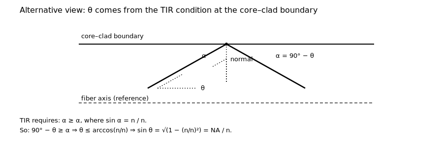
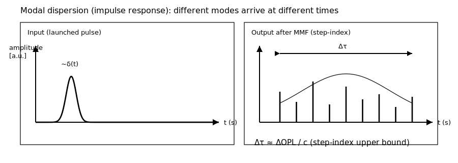
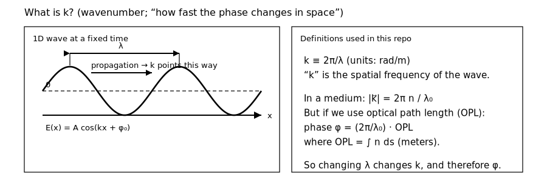
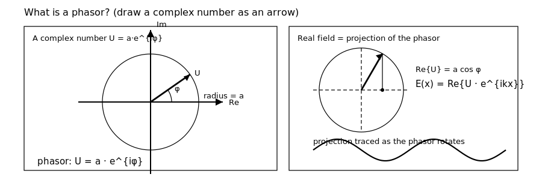
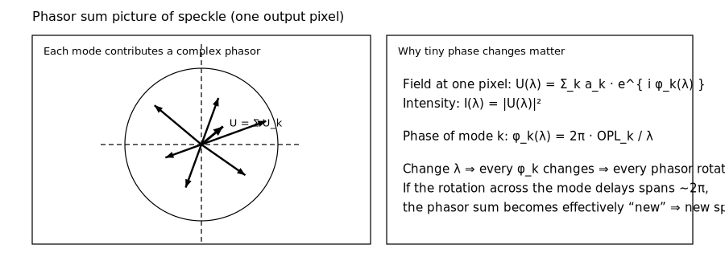
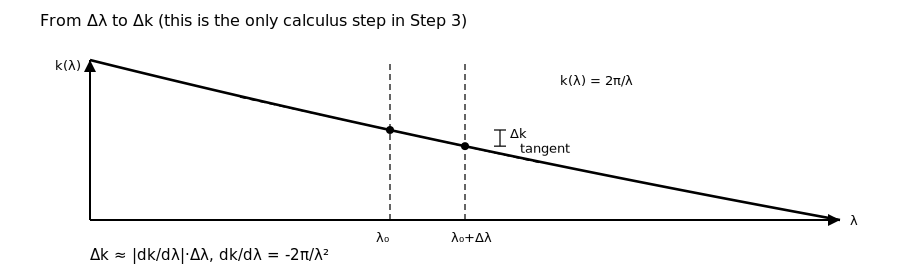

<!--
AUTO-GENERATED FILE. DO NOT EDIT DIRECTLY.
Source: notebooks/14_stepindex_mmf_spectral_linewidth_physics.py
Generated by: scripts/export_notebooks_markdown.py
-->

# Step-index MMF + spectral linewidth

This notebook is meant to be a **single place** where you can build real intuition for:

- why a **step-index multimode fiber (MMF)** can create a **very small** spectral correlation width
  (often **~0.01 nm scale** for meter-scale fibers), and therefore
- why a **few-nm instantaneous linewidth** can average **many effectively independent** speckle patterns
  *within a single short exposure* (e.g. 500 μs).

It merges two kinds of content into one read-through:

1) **SVG “whiteboard diagrams”** (tracked in the repo under `docs/figures/`).
2) **Python-generated plots + toy simulations**, including a small **interactive slider**.

Companion files:

- `docs/MEETING_PREP_LASER_STAFF_SCIENTIST.md` (one-page chain + questions)
- `notebooks/13_cni_2nm_stepindex_spectral_diversity_500us.py` (scenario sweeps)

---

## What you should get from this notebook

1. A defensible derivation chain:

   $$
   \theta_{\max}\;\Rightarrow\;\Delta\mathrm{OPL}\;\Rightarrow\;\Delta\lambda_c\;\Rightarrow\;N_{\lambda}\;\Rightarrow\;C.
   $$

2. A *discrete* picture for the key confusion:

   > “Why can two narrow spikes separated by **0.01 nm** produce **uncorrelated** speckle?”

3. Multiple views of the same idea (ray picture, phase-vs-λ picture, correlation-vs-δλ picture, toy speckle simulation).

4. Practical “meeting-ready” numbers: what changes when you change **L**, **NA**, **n**, and “how graded-index it is”.

## 0) Imports + repo plumbing

Notes:

- These notebooks are tracked as **Jupytext percent** (`*.py`). You can convert to `ipynb` locally.
- This repo keeps **binary outputs** out of git; the notebook should be executed locally and exported to HTML/PDF for printing.

<details>
<summary>Code cell 1</summary>

```python
from __future__ import annotations

import math
import sys
from pathlib import Path

import matplotlib
import matplotlib.pyplot as plt
import numpy as np
import pandas as pd

# Plotly is used for one interactive slider-based visualization.
# It is optional: the notebook still runs if it's missing (interactive section will be skipped).
try:
    import plotly.graph_objects as go
    import plotly.io as pio
    from plotly.subplots import make_subplots

    HAS_PLOTLY = True
except ModuleNotFoundError:
    HAS_PLOTLY = False
    go = None  # type: ignore[assignment]
    pio = None  # type: ignore[assignment]
    make_subplots = None  # type: ignore[assignment]

# If we are in a notebook, prefer inline backend.
if "ipykernel" in sys.modules:
    try:
        if matplotlib.get_backend().lower() == "agg":
            matplotlib.use("module://matplotlib_inline.backend_inline", force=True)
    except Exception:
        pass


def find_repo_root(start: Path) -> Path:
    """Find repo root by walking upward until we see (src/, environment.yml)."""
    p = start.resolve()
    for parent in [p, *p.parents]:
        if (parent / "src").is_dir() and (parent / "environment.yml").exists():
            return parent
    return p


REPO_ROOT = find_repo_root(Path.cwd())
if str(REPO_ROOT) not in sys.path:
    sys.path.insert(0, str(REPO_ROOT))

FIG_DIR = REPO_ROOT / "docs" / "figures"

from src.mmf_fiber_speckle import (  # noqa: E402
    MultimodeFiber,
    max_guided_meridional_ray_angle_rad,
    optical_path_spread_geometric_step_index_m,
    speckle_spectral_corr_width_nm,
)
from src.speckle_weighting import effective_n_from_weights  # noqa: E402
from src.temporal_coherence import (  # noqa: E402
    coherence_length_m_from_linewidth_nm,
    coherence_time_s_from_linewidth_nm,
    delta_nu_hz_from_delta_lambda_nm,
)

# Toy speckle generator: disk-basis "modes" used elsewhere in this repo.
from src.fiber_modes import (  # noqa: E402
    disk_mode_indices,
    intensity_from_field,
    make_core_grid,
    precompute_mode_stack,
    random_complex_coeffs,
    speckle_contrast,
    superpose_modes,
)

plt.rcParams.update({"figure.figsize": (7.8, 4.6), "figure.dpi": 120})

# Plotly renderer: choose what works in your setup.
# Good defaults:
#   "vscode" (VS Code), "notebook" (classic), "jupyterlab", or "browser".
# We keep it explicit but do not force a value.
if HAS_PLOTLY:
    pio.renderers.default = pio.renderers.default
```

</details>

## 1) Configuration (meeting defaults)

We keep numbers aligned with notebook 13:

- Center wavelength: 640 nm
- Fiber: 400 μm core, NA=0.22, length=3 m, silica-like index ~1.46
- Example linewidths / separations: 0.002–20 nm

Important distinction:

- **Δλ_src** in the speckle-averaging model means the **instantaneous** spectral span present *within one exposure*.
- An OSA “2–3 nm” measurement can be **time-averaged**; that can be irrelevant if the source is narrow on 500 μs timescales.

<details>
<summary>Code cell 2</summary>

```python
lambda0_nm = 640.0

fiber = MultimodeFiber(
    core_diameter_um=400.0,
    na=0.22,
    length_m=3.0,
    n_core=1.46,
    modal_delay_scale=1.0,  # 1.0 = step-index-like upper bound; <<1 = more graded-index-like
)

# A few example wavelength separations / spans.
linewidth_examples_nm = [0.002, 0.005, 0.008, 0.01, 0.02, 0.1, 0.5, 2.0, 5.0, 20.0]

pd.DataFrame(
    [
        {
            "λ0_nm": lambda0_nm,
            "L_m": fiber.length_m,
            "NA": fiber.na,
            "n_core": fiber.n_core,
            "modal_delay_scale": fiber.modal_delay_scale,
        }
    ]
)
```

</details>

## 2) Symbol table (so we stop getting lost)

This notebook uses a small number of “load-bearing” symbols. Here is a quick reference.

| Symbol | Meaning | Typical value here | Units |
|---|---|---:|---|
| $\lambda$ | Wavelength | 640 | nm |
| $\delta\lambda$ | Separation between two narrow spectral spikes | 0.01 | nm |
| $\Delta\lambda_{\mathrm{src}}$ | Instantaneous spectral span present during one exposure | 2–5 | nm |
| $\mathrm{NA}$ | Fiber numerical aperture (guidance) | 0.22 | (unitless) |
| $n$ | Core index (effective) | 1.46 | (unitless) |
| $L$ | Fiber length | 3 | m |
| $\theta_{\max}$ | Max guided *internal* ray angle in core | ~9 | deg |
| $\Delta\mathrm{OPL}$ | Intermodal optical-path *spread* (vacuum-equivalent) | ~0.05 | m |
| $\Delta\tau$ | Intermodal group delay spread | ~170 | ps |
| $\Delta\lambda_c$ | Speckle spectral correlation width | ~0.008 | nm |
| $N_\lambda$ | # of (effectively) independent spectral speckle patterns in the exposure | ~250 for 2 nm | (unitless) |
| $C$ | Speckle contrast (RMS/mean) | ~0.06 (optimistic) | (unitless) |

A note on “$\Delta$” vs “$\delta$”:

- $\delta\lambda$ is often used as a variable “offset” (e.g. the separation between two spikes).
- $\Delta\lambda_c$ is the **characteristic** width that makes the correlation drop (a property of the fiber).

## 3) Step 1: why $\sin\theta_{\max}\approx \mathrm{NA}/n_{\mathrm{core}}$?




In the figures:

- **solid lines** = rays
- **dashed lines** = reference lines (fiber axis, angle markers)

This is a common point of confusion, because “fiber NA” is often introduced as an **external acceptance cone in air**.
The cleanest way to stay un-confused is to keep **two equivalent derivations** in your pocket:

---

### 1) Internal picture: $\theta_{\max}$ comes from total internal reflection (TIR)

Start from the **definition** (step-index):

$$
\mathrm{NA} \equiv \sqrt{n_{\mathrm{core}}^2 - n_{\mathrm{clad}}^2}.
$$

Now connect that to the *largest internal guided angle*.

1. Let a **meridional ray** in the core make an angle $\theta$ to the **fiber axis**.

2. When that ray hits a (locally flat) core–clad boundary, its **incidence angle** (relative to the surface normal) is:

   $$
   \alpha = \frac{\pi}{2}-\theta.
   $$

   (Because the fiber axis is parallel to the boundary surface.)

3. Total internal reflection requires $\alpha\ge\alpha_c$, where the **critical angle** satisfies:

   $$
   \sin\alpha_c = \frac{n_{\mathrm{clad}}}{n_{\mathrm{core}}}.
   $$

4. Combine the last two lines:

   $$
   \frac{\pi}{2}-\theta \ge \alpha_c
   \;\Rightarrow\;
   \theta \le \frac{\pi}{2}-\alpha_c
   = \arccos\!\left(\frac{n_{\mathrm{clad}}}{n_{\mathrm{core}}}\right).
   $$

5. Take the sine (this is the part you want to remember):

   $$
   \sin\theta_{\max}
   = \sqrt{1-\left(\frac{n_{\mathrm{clad}}}{n_{\mathrm{core}}}\right)^2}
   = \frac{\sqrt{n_{\mathrm{core}}^2-n_{\mathrm{clad}}^2}}{n_{\mathrm{core}}}
   = \frac{\mathrm{NA}}{n_{\mathrm{core}}}.
   $$

---

### 2) External picture: connect to the “acceptance cone in air”

At the **input face**, Snell’s law relates external angle $u$ (in air) and internal angle $\theta$ (in core):

$$
n_0\sin u = n_{\mathrm{core}}\sin\theta.
$$

A standard result for a step-index fiber is that the **external** acceptance half-angle $u_{\max}$ satisfies:

$$
n_0\sin u_{\max} = \mathrm{NA}.
$$

Combine those two statements at the launch limit ($u=u_{\max}$):

$$
\sin\theta_{\max}
= \frac{n_0}{n_{\mathrm{core}}}\sin u_{\max}
= \frac{\mathrm{NA}}{n_{\mathrm{core}}}.
$$

For air, $n_0\approx 1$, so you often see the shorthand:

$$
\sin u_{\max}\approx \mathrm{NA},\qquad
\sin\theta_{\max}\approx \mathrm{NA}/n_{\mathrm{core}}.
$$

---

### Intuition: what the division by $n_{\mathrm{core}}$ is really saying

The fiber limits how much **transverse** momentum you can have:

$$
k_{\perp,\max} = k_0\,\mathrm{NA},\qquad k_0=\frac{2\pi}{\lambda}.
$$

Inside the core, the total wavevector magnitude is $|k|=n_{\mathrm{core}}k_0$, so:

$$
\sin\theta_{\max}=\frac{k_{\perp,\max}}{|k|}
= \frac{k_0\,\mathrm{NA}}{n_{\mathrm{core}}k_0}
= \frac{\mathrm{NA}}{n_{\mathrm{core}}}.
$$

Why we care: once $\theta_{\max}$ is set, **everything else** in this notebook flows from the fact that path length scales like $1/\cos\theta$.

<details>
<summary>Code cell 3</summary>

```python
n0 = 1.0  # refractive index outside the fiber (air)

# Internal max guided meridional ray angle (core).
theta_max_rad = max_guided_meridional_ray_angle_rad(na=fiber.na, n_core=fiber.n_core)
theta_max_deg = theta_max_rad * 180.0 / math.pi

# External acceptance half-angle in air u_max, from: n0 sin u_max = NA.
u_max_rad = math.asin(min(1.0, fiber.na / n0))
u_max_deg = u_max_rad * 180.0 / math.pi

# Back out an implied n_clad from (NA, n_core) for sanity checks.
n_clad = math.sqrt(max(0.0, fiber.n_core * fiber.n_core - fiber.na * fiber.na))

# Critical angle (core->clad) relative to the normal: sin(alpha_c) = n_clad / n_core.
alpha_c_rad = math.asin(min(1.0, n_clad / fiber.n_core))
alpha_c_deg = alpha_c_rad * 180.0 / math.pi

pd.DataFrame(
    [
        {
            "NA": fiber.na,
            "n0 (air)": n0,
            "n_core": fiber.n_core,
            "n_clad (implied)": n_clad,
            "u_max_deg (external in air)": u_max_deg,
            "sin(u_max) = NA/n0": math.sin(u_max_rad),
            "theta_max_deg (internal in core)": theta_max_deg,
            "sin(theta_max) = NA/n_core": math.sin(theta_max_rad),
            "NA/n_core": fiber.na / fiber.n_core,
            "alpha_c_deg (critical, to normal)": alpha_c_deg,
        }
    ]
)
```

</details>

## 4) Step 2: where does $\Delta\mathrm{OPL}\approx (\mathrm{NA}^2/(2n))\,L$ come from?


**Start with geometry.** For a straight fiber, think of two limiting meridional rays:

- an axial ray ($\theta=0$)
- the highest-angle guided ray ($\theta=\theta_{\max}$)

The **geometric path length** is:

$$
\ell(\theta) = \frac{L}{\cos\theta}.
$$

The **optical path length** (OPL) is refractive index times geometric length:

$$
\mathrm{OPL}(\theta)=n\,\ell(\theta)=\frac{nL}{\cos\theta}.
$$

So the spread between the two extremes is:

$$
\Delta\mathrm{OPL} = \mathrm{OPL}(\theta_{\max})-\mathrm{OPL}(0)
= nL\left(\frac{1}{\cos\theta_{\max}}-1\right).
$$

**Small-angle approximation.** If $\theta$ is small, $\cos\theta\approx 1-\theta^2/2$, so:

$$
\frac{1}{\cos\theta}-1 \approx \frac{\theta^2}{2}.
$$

With $\sin\theta\approx\theta$ and $\sin\theta_{\max}\approx \mathrm{NA}/n$:

$$
\Delta\mathrm{OPL} \approx nL\,\frac{\theta_{\max}^2}{2}
\approx nL\,\frac{1}{2}\left(\frac{\mathrm{NA}}{n}\right)^2
= \frac{\mathrm{NA}^2}{2n}\,L.
$$

**Interpretation:**

- Larger **NA** means you guide higher-angle rays/modes → longer zig-zag paths → larger delay spread.
- Longer **L** gives more accumulated delay spread.
- Larger **n** makes the internal angles smaller (for the same NA), reducing the spread.

### 4.2 A common confusion: `NA/n` is **not** ΔOPL

In your notes you wrote something like:

$$
\Delta\mathrm{OPL} \stackrel{?}{\approx} \frac{\sqrt{n_\mathrm{core}^2-n_\mathrm{clad}^2}}{n_\mathrm{core}}\,L.
$$

The dimensionless factor

$$
\frac{\sqrt{n_\mathrm{core}^2-n_\mathrm{clad}^2}}{n_\mathrm{core}}
= \frac{\mathrm{NA}}{n_\mathrm{core}}
= \sin\theta_\max,
$$

is the **maximum guided internal ray angle** (in sine form).

To get a *path-length* spread you need the geometry factor $1/\cos\theta$:

$$
\mathrm{OPL}(\theta)=n_\mathrm{core}\,\frac{L}{\cos\theta},
\qquad
\Delta\mathrm{OPL}=n_\mathrm{core}L\left(\frac{1}{\cos\theta_\max}-1\right).
$$

For a step-index fiber, total internal reflection gives:

$$
\cos\theta_\max = \frac{n_\mathrm{clad}}{n_\mathrm{core}},
$$

so you can also write the exact expression as:

$$
\Delta\mathrm{OPL}
= n_\mathrm{core}L\left(\frac{n_\mathrm{core}}{n_\mathrm{clad}}-1\right).
$$

**Weak-guidance limit (very common):** if $n_\mathrm{core}\approx n_\mathrm{clad}\equiv n$ then

$$
\Delta\mathrm{OPL} \approx (n_\mathrm{core}-n_\mathrm{clad})L
\approx \frac{\mathrm{NA}^2}{2n}\,L.
$$

where the last step uses $\mathrm{NA}^2=n_\mathrm{core}^2-n_\mathrm{clad}^2\approx 2n(n_\mathrm{core}-n_\mathrm{clad})$.

**Key behaviors to notice:**

- ΔOPL scales **linearly** with fiber length $L$.
- ΔOPL scales roughly like **NA²** (bigger acceptance angle → more zig‑zag).
- For fixed NA, increasing $n$ makes $\theta_\max\approx \mathrm{NA}/n$ smaller, reducing ΔOPL.

<details>
<summary>Code cell 4</summary>

```python
# Exact geometric expression using theta_max
theta_max_rad = max_guided_meridional_ray_angle_rad(na=fiber.na, n_core=fiber.n_core)
theta_max_deg = np.degrees(theta_max_rad)

# For a step-index fiber in air: NA^2 = n_core^2 - n_clad^2  ->  n_clad = sqrt(n_core^2 - NA^2)
n_clad = math.sqrt(max(fiber.n_core * fiber.n_core - fiber.na * fiber.na, 0.0))

# Sanity checks that tie the geometry to the refractive indices
sin_theta_max = math.sin(theta_max_rad)
cos_theta_max = math.cos(theta_max_rad)
cos_theta_from_indices = n_clad / fiber.n_core if fiber.n_core > 0 else float('nan')

opl_spread_exact_m = optical_path_spread_geometric_step_index_m(length_m=fiber.length_m, na=fiber.na, n_core=fiber.n_core)

# Small-angle approximation: ΔOPL ≈ (NA^2/(2n)) L
opl_spread_small_angle_m = (fiber.na * fiber.na) * fiber.length_m / (2.0 * fiber.n_core)

# Convert the optical path spread into a (worst-case) time spread in the impulse response
C_M_PER_S = 299_792_458.0
delta_tau_s = opl_spread_exact_m / C_M_PER_S

pd.DataFrame(
    [
        {
            'L_m': fiber.length_m,
            'n_core': fiber.n_core,
            'NA': fiber.na,
            'n_clad≈sqrt(n_core^2-NA^2)': n_clad,
            'sinθ_max = NA/n_core': sin_theta_max,
            'θ_max_deg': theta_max_deg,
            'cosθ_max': cos_theta_max,
            'cosθ_max (n_clad/n_core)': cos_theta_from_indices,
            'ΔOPL_exact_mm': 1e3 * opl_spread_exact_m,
            'ΔOPL_small_angle_mm': 1e3 * opl_spread_small_angle_m,
            'ratio_exact/small': opl_spread_exact_m / opl_spread_small_angle_m,
            'Δτ_ps = ΔOPL/c': 1e12 * delta_tau_s,
        }
    ]
)
```

</details>


### 4.3 Physical picture: ΔOPL ↔ pulse broadening (impulse response)



The **optical path** spread $\Delta\mathrm{OPL}$ corresponds to a **time-of-flight** spread:

$$
\Delta\tau \approx \frac{\Delta\mathrm{OPL}}{c}.
$$

This is the step-index “upper bound” picture of **modal dispersion**:
a short input pulse is replicated into many delayed contributions (one per guided mode / ray),
producing an output pulse whose duration is on the order of $\Delta\tau$.

**About your sketch (“a femtosecond delta pulse becomes ~100 ps over 3 m”):**

- The *modal* delay spread for the default fiber here is ~170 ps, so the **order of magnitude is right**.
- A truly **single exact wavelength** is a continuous wave, not a pulse. In practice we mean a *narrowband*
  pulse envelope on a carrier: the envelope can broaden due to modal delay even if the carrier is “one line”.
- A real femtosecond pulse has a **large bandwidth**, so in addition to modal dispersion you will also have
  *chromatic* dispersion; here we are isolating the step-index modal contribution.

<details>
<summary>Code cell 5</summary>

```python
# Toy “impulse response” broadening from modal delays
# (Cartoon model: many delayed replicas of the same input envelope.)
rng = np.random.default_rng(0)
n_modes_toy = 250
delays_s = rng.uniform(0.0, delta_tau_s, size=n_modes_toy)
weights = rng.random(n_modes_toy)
weights = weights / weights.sum()

# Time axis wide enough to show the whole delay spread
t_s = np.linspace(-0.2 * delta_tau_s, 1.2 * delta_tau_s, 3000)

# Input envelope: choose something “short” compared to Δτ so the broadening is obvious
fwhm_in_ps = 1.0
sigma_in_s = (fwhm_in_ps * 1e-12) / (2.0 * np.sqrt(2.0 * np.log(2.0)))
input_env = np.exp(-0.5 * (t_s / sigma_in_s) ** 2)

# Output: weighted sum of delayed replicas
output_env = np.zeros_like(t_s)
for d_s, w in zip(delays_s, weights):
    output_env += w * np.exp(-0.5 * ((t_s - d_s) / sigma_in_s) ** 2)

# Normalize for display
input_env = input_env / input_env.max()
output_env = output_env / output_env.max()

fig, ax = plt.subplots(figsize=(7.8, 3.6))
ax.plot(t_s * 1e12, input_env, label='input envelope (toy)')
ax.plot(t_s * 1e12, output_env, label='output after modal delays (toy)')
ax.axvline(0.0, linestyle='--', alpha=0.3)
ax.axvline(delta_tau_s * 1e12, linestyle='--', alpha=0.3, label='Δτ')
ax.set_xlabel('time (ps)')
ax.set_ylabel('normalized amplitude (a.u.)')
ax.set_title('Cartoon of pulse broadening from a delay spread Δτ')
ax.grid(True, alpha=0.3)
ax.legend()
plt.show()

# ### 4.4 How accurate is the small-angle approximation for NA=0.22?
# 
# It matters because the “0.008 nm” number ultimately depends on $\Delta\mathrm{OPL}$.
# 
# The good news: for NA≈0.22 in silica, it’s a **few-percent** effect.
```

</details>

<details>
<summary>Code cell 6</summary>

```python
na_grid = np.linspace(0.05, 0.40, 80)
ratios = []
for na in na_grid:
    exact = optical_path_spread_geometric_step_index_m(length_m=fiber.length_m, na=float(na), n_core=fiber.n_core)
    approx = (na * na) * fiber.length_m / (2.0 * fiber.n_core)
    ratios.append(exact / approx)

fig, ax = plt.subplots(figsize=(7.8, 4.2))
ax.plot(na_grid, ratios)
ax.axvline(fiber.na, linestyle="--", alpha=0.6)
ax.set_title("Exact ΔOPL / small-angle ΔOPL vs NA (L fixed)")
ax.set_xlabel("Fiber NA")
ax.set_ylabel("ratio")
ax.grid(True, alpha=0.3)
plt.show()
```

</details>

### 4.5 Interactive intuition builder: NA, L → ΔOPL and Δλ_c

The formulas above can feel abstract until you *move the knobs*.
The slider below lets you vary the fiber length $L$ and see:

- **Top:** exact and small-angle $\Delta\mathrm{OPL}$ (mm) vs NA
- **Bottom:** predicted decorrelation width $\Delta\lambda_c\approx \lambda^2/\Delta\mathrm{OPL}$ (nm)

(If Plotly is not installed, this section will be skipped.)

<details>
<summary>Code cell 7</summary>

```python
# Interactive: ΔOPL and Δλc vs NA for several fiber lengths
if HAS_PLOTLY:
    na_grid = np.linspace(0.05, 0.40, 220)
    L_grid_m = [0.5, 1.0, 2.0, 3.0, 5.0, 10.0]

    frames = []
    for L_m in L_grid_m:
        opl_exact_mm = []
        opl_approx_mm = []
        dlam_c_nm_curve = []
        for na in na_grid:
            exact_m = optical_path_spread_geometric_step_index_m(length_m=float(L_m), na=float(na), n_core=fiber.n_core)
            approx_m = (na * na) * float(L_m) / (2.0 * fiber.n_core)
            opl_exact_mm.append(1e3 * exact_m)
            opl_approx_mm.append(1e3 * approx_m)
            dlam_c_nm_curve.append(speckle_spectral_corr_width_nm(lambda0_nm=lambda0_nm, delta_opl_m=exact_m))

        frames.append(
            go.Frame(
                name=f"L={L_m:g} m",
                data=[
                    go.Scatter(x=na_grid, y=opl_exact_mm, mode='lines', name='ΔOPL exact (mm)'),
                    go.Scatter(x=na_grid, y=opl_approx_mm, mode='lines', name='ΔOPL small-angle (mm)'),
                    go.Scatter(x=na_grid, y=dlam_c_nm_curve, mode='lines', name='Δλ_c ≈ λ²/ΔOPL (nm)'),
                ],
            )
        )

    fig = make_subplots(
        rows=2,
        cols=1,
        shared_xaxes=True,
        vertical_spacing=0.12,
        subplot_titles=(
            'Optical path spread ΔOPL (exact vs small-angle)',
            'Predicted decorrelation width Δλ_c ≈ λ²/ΔOPL',
        ),
    )

    # Initial frame
    init = frames[0].data
    fig.add_trace(init[0], row=1, col=1)
    fig.add_trace(init[1], row=1, col=1)
    fig.add_trace(init[2], row=2, col=1)

    # Reference line at the NA used elsewhere in this notebook
    fig.add_vline(x=fiber.na, line_dash='dash', opacity=0.5, row=1, col=1)
    fig.add_vline(x=fiber.na, line_dash='dash', opacity=0.5, row=2, col=1)

    fig.update_yaxes(title_text='ΔOPL (mm)', row=1, col=1)
    fig.update_yaxes(title_text='Δλ_c (nm)', row=2, col=1)
    fig.update_xaxes(title_text='Fiber NA', row=2, col=1)

    steps = []
    for fr in frames:
        steps.append(
            {
                'method': 'animate',
                'label': fr.name.split('=')[1],
                'args': [[fr.name], {'mode': 'immediate', 'frame': {'duration': 0, 'redraw': True}}],
            }
        )

    fig.update_layout(
        height=650,
        showlegend=True,
        title_text='Interactive: Step-index ΔOPL and Δλ_c vs NA (slide L)',
        sliders=[{'active': 0, 'currentvalue': {'prefix': 'L = '}, 'pad': {'t': 40}, 'steps': steps}],
    )
    fig.frames = frames
    fig.show()
else:
    print('Plotly not installed; skipping interactive ΔOPL/Δλc plot.')
```

</details>

## Interlude: what are $k$ and “phasors” (just enough for Step 3)

Step 3 often feels like it comes out of nowhere because a few *optics shorthand* ideas appear suddenly.
This interlude is meant to make those explicit.

### What is $k$?



- The **wavenumber** $k$ is the spatial frequency of the optical carrier.
- In free space (vacuum wavelength $\lambda$):

$$
k \equiv \frac{2\pi}{\lambda}\quad\text{(units: rad/m).}
$$

- A 1D monochromatic wave can be written as:

$$
E(x) = \mathrm{Re}\{U\,e^{i k x}\}.
$$

Here **$U$ is a complex amplitude** (a “phasor”), and $\mathrm{Re}\{\cdot\}$ means “take the real part”.

### What is a phasor?



A **phasor** is just a complex number drawn as a 2D arrow:

$$
U = a\,e^{i\phi}.
$$

- length $a$ = amplitude
- angle $\phi$ = phase

The reason phasors are useful is that **interference is vector addition** in the complex plane.

### Why does this matter for MMF speckle?



In a multimode fiber, at a given output pixel you can think:

$$
U(\lambda)=\sum_k a_k\,e^{i\phi_k(\lambda)},\qquad I(\lambda)=|U(\lambda)|^2.
$$

Changing wavelength changes $k=2\pi/\lambda$, which changes every $\phi_k$, which rotates every phasor.
Step 3 is just the statement: *how big must Δλ be before those rotations “scramble” the sum?*

<details>
<summary>Code cell 8</summary>

```python
# Toy phasor-sum picture: same paths, different wavelengths
dlam_c_nm_preview = speckle_spectral_corr_width_nm(lambda0_nm=lambda0_nm, delta_opl_m=opl_spread_exact_m)

rng = np.random.default_rng(1)
n_phasors = 22

# Only relative path lengths matter for speckle, so use δOPL in [0, ΔOPL].
delta_opls_m = rng.uniform(0.0, opl_spread_exact_m, size=n_phasors)
amps = rng.uniform(0.4, 1.0, size=n_phasors)

def phasors_for_lambda_nm(lam_nm: float) -> np.ndarray:
    lam_m = lam_nm * 1e-9
    phases = 2.0 * np.pi * (delta_opls_m / lam_m)
    return amps * np.exp(1j * phases)

def plot_phasors(ax: plt.Axes, U: np.ndarray, title: str) -> None:
    for u in U:
        ax.arrow(0.0, 0.0, np.real(u), np.imag(u), head_width=0.06, length_includes_head=True, alpha=0.6)
    u_sum = U.sum()
    ax.arrow(0.0, 0.0, np.real(u_sum), np.imag(u_sum), head_width=0.12, length_includes_head=True, linewidth=2.5)
    ax.axhline(0.0, color='k', linewidth=1, alpha=0.3)
    ax.axvline(0.0, color='k', linewidth=1, alpha=0.3)
    lim = 1.15 * max(np.max(np.abs(np.real(U))), np.max(np.abs(np.imag(U))), abs(u_sum))
    ax.set_xlim(-lim, lim)
    ax.set_ylim(-lim, lim)
    ax.set_aspect('equal')
    ax.set_xticks([])
    ax.set_yticks([])
    ax.set_title(title, fontsize=11)

dlam_list_nm = [0.0, 0.25 * dlam_c_nm_preview, 1.0 * dlam_c_nm_preview]
fig, axes = plt.subplots(1, 3, figsize=(11.4, 3.8))
for ax, dlam_nm in zip(axes, dlam_list_nm):
    lam_nm = lambda0_nm + float(dlam_nm)
    U = phasors_for_lambda_nm(lam_nm)
    plot_phasors(
        ax,
        U,
        title=f"λ = {lam_nm:.6f} nm\n|ΣU_k| = {abs(U.sum()):.2f}",
    )

fig.suptitle(
    f"Toy phasor sums: increasing Δλ rotates phasors (Δλ_c≈{dlam_c_nm_preview:.4f} nm for this fiber)",
    y=1.02,
)
plt.show()
```

</details>

## 5) Step 3: why $\Delta\lambda_c \sim \lambda^2/\Delta\mathrm{OPL}$?

This step answers the question:

> *How much do I need to change wavelength before the MMF speckle pattern becomes essentially “new”?*

The answer is controlled by **how fast phase changes with wavelength** when you have a spread of optical path lengths.


---

### 5.1 Start from the phase of one path

A guided contribution with optical path length $\mathrm{OPL}$ accumulates optical phase

$$
\phi(\lambda)=\frac{2\pi}{\lambda}\,\mathrm{OPL}.
$$

This is often written with a shorthand **wavenumber**

$$
k(\lambda) \equiv \frac{2\pi}{\lambda},
\qquad
\Rightarrow
\qquad
\phi(\lambda)=k(\lambda)\,\mathrm{OPL}.
$$

(So: *“$k$ suddenly appeared”* just means we renamed $2\pi/\lambda$ as $k$.)

In a MMF there is a **spread** of relevant optical path lengths. Define

$$
\Delta\mathrm{OPL} \equiv \max_k(\mathrm{OPL}_k)-\min_k(\mathrm{OPL}_k).
$$

Speckle depends on **relative phases**, so it decorrelates when the relative phases across this spread shift by order $2\pi$.

---

### 5.2 “No calculus” derivation (finite difference + Taylor)

Consider the *simplest interference problem*: two contributions whose optical path lengths differ by $\Delta\mathrm{OPL}$.
Their relative phase is

$$
\Delta\phi(\lambda)=\frac{2\pi\,\Delta\mathrm{OPL}}{\lambda}.
$$

Ask for the wavelength change $\Delta\lambda$ that shifts this relative phase by $2\pi$:

$$
\Delta\phi(\lambda+\Delta\lambda)-\Delta\phi(\lambda)\approx 2\pi.
$$

Compute the difference explicitly:

$$
2\pi\,\Delta\mathrm{OPL}\left(\frac{1}{\lambda+\Delta\lambda}-\frac{1}{\lambda}\right)\approx 2\pi.
$$

For small $\Delta\lambda\ll\lambda$, use the first-order Taylor expansion

$$
\frac{1}{\lambda+\Delta\lambda}\approx \frac{1}{\lambda}-\frac{\Delta\lambda}{\lambda^2}.
$$

Plugging that in gives (up to sign):

$$
2\pi\,\Delta\mathrm{OPL}\,\frac{\Delta\lambda}{\lambda^2} \sim 2\pi
\quad\Rightarrow\quad
\Delta\lambda_c \sim \frac{\lambda^2}{\Delta\mathrm{OPL}}.
$$

This already contains the key physics: **bigger $\Delta\mathrm{OPL}$ ⇒ smaller $\Delta\lambda_c$**.

---

### 5.3 The compact $\Delta k\,\Delta\mathrm{OPL}\sim 2\pi$ argument (one derivative)

If you *are* comfortable with derivatives, the same Taylor step can be written as a derivative of $k(\lambda)$:



$$
\Delta k \approx \left|\frac{\mathrm{d}k}{\mathrm{d}\lambda}\right|\,\Delta\lambda
= \left|\frac{\mathrm{d}}{\mathrm{d}\lambda}\left(\frac{2\pi}{\lambda}\right)\right|\Delta\lambda
= \frac{2\pi}{\lambda^2}\,\Delta\lambda.
$$

The decorrelation condition is “phase shift across the path spread is $\sim 2\pi$”:

$$
\Delta k\,\Delta\mathrm{OPL}\sim 2\pi
\quad\Rightarrow\quad
\Delta\lambda_c \sim \frac{\lambda^2}{\Delta\mathrm{OPL}}.
$$

**Units sanity check:** $k$ is rad/m, $\Delta\mathrm{OPL}$ is m, so $\Delta k\,\Delta\mathrm{OPL}$ is radians.

---

### 5.4 Time/frequency version (often the cleanest intuition)

Convert the path spread into a delay spread:

$$
\Delta\tau = \Delta\mathrm{OPL}/c.
$$

In frequency units, phase is $\phi=2\pi\nu\tau$, so changing optical frequency by $\Delta\nu$ shifts phase by

$$
\Delta\phi = 2\pi\,\Delta\nu\,\Delta\tau.
$$

Setting $\Delta\phi\sim 2\pi$ gives the standard Fourier-ish scaling

$$
\Delta\nu_c \sim \frac{1}{\Delta\tau}.
$$

Using $\nu=c/\lambda$ and $\Delta\nu\approx (c/\lambda^2)\Delta\lambda$ yields the same
$\Delta\lambda_c\sim \lambda^2/\Delta\mathrm{OPL}$.

---

A one-page scaling summary (useful for meeting notes):


<details>
<summary>Code cell 9</summary>

```python
# Compute the predicted spectral decorrelation width from ΔOPL
dlam_c_nm = speckle_spectral_corr_width_nm(lambda0_nm=lambda0_nm, delta_opl_m=opl_spread_exact_m)

# Helpful derived quantity: delay spread
C_M_PER_S = 299_792_458.0
delta_tau_s = opl_spread_exact_m / C_M_PER_S

summary = pd.DataFrame(
    [
        {
            'λ0_nm': lambda0_nm,
            'ΔOPL_mm': opl_spread_exact_m * 1e3,
            'Δτ_ps': delta_tau_s * 1e12,
            'Δλ_c_nm (≈λ²/ΔOPL)': dlam_c_nm,
        }
    ]
)
summary

# ---
# Toy example: two-path interference vs wavelength
#
# If two paths differ by ΔOPL, the interference term contains cos(2π ΔOPL / λ).
# As λ changes, that cosine oscillates with a characteristic period ~ λ²/ΔOPL.
lam_nm = np.linspace(lambda0_nm - 0.05, lambda0_nm + 0.05, 2500)
lam_m = lam_nm * 1e-9
phi_rad = 2.0 * np.pi * opl_spread_exact_m / lam_m
I_norm = 1.0 + np.cos(phi_rad)

fig, ax = plt.subplots(figsize=(7.8, 3.8))
ax.plot(lam_nm, I_norm)
ax.axvline(lambda0_nm, linestyle='--', alpha=0.4, label='λ0')
ax.axvline(lambda0_nm + dlam_c_nm, linestyle=':', alpha=0.9, label='λ0+Δλ_c')
ax.set_title('Two-path interference vs wavelength (fringe scale set by ΔOPL)')
ax.set_xlabel('wavelength λ (nm)')
ax.set_ylabel('normalized intensity (a.u.)')
ax.grid(True, alpha=0.3)
ax.legend()
plt.show()

print(f"For ΔOPL≈{opl_spread_exact_m*1e3:.1f} mm at λ0={lambda0_nm:.0f} nm, Δλ_c≈{dlam_c_nm:.4f} nm.")
```

</details>

## 6) The 0.01 nm question (the discrete picture)

You said you want a concrete mental model for:

> “Why do two spikes separated by ~0.01 nm give unrelated speckle?”


A really compact derivation is to look at how much the **relative phase** changes.

Consider a guided contribution with optical path length $\mathrm{OPL}_k$.
Its phase is:

$$
\phi_k(\lambda)=\frac{2\pi\,\mathrm{OPL}_k}{\lambda}.
$$

For a small wavelength shift $\delta\lambda$:

$$
\delta\phi_k \approx \left|\frac{\mathrm{d}\phi_k}{\mathrm{d}\lambda}\right|\delta\lambda
= \frac{2\pi\,\mathrm{OPL}_k}{\lambda^2}\,\delta\lambda.
$$

The key is the **spread** of these phase changes across the guided set.
If the paths span $\Delta\mathrm{OPL}$, then the phase swing across the set is approximately:

$$
\delta\phi_{\max} \approx \frac{2\pi\,\Delta\mathrm{OPL}}{\lambda^2}\,\delta\lambda
= 2\pi\,\frac{\delta\lambda}{\Delta\lambda_c}.
$$

So:

- If $\delta\lambda = \Delta\lambda_c$, you get $\delta\phi_{\max}\approx 2\pi$.
- If $\delta\lambda > \Delta\lambda_c$, you get *more than* a full cycle of relative phase spread.


Another view (same math, different picture): a wavelength shift creates a **phase ramp** across the mode delay spread.


That’s exactly the “two spikes give independent speckle” statement.

<details>
<summary>Code cell 10</summary>

```python
# Evaluate delta-phi swing across the spread for a few delta-lambda values.
delta_lams_nm = np.array([0.002, 0.005, 0.008, 0.01, 0.02, 0.05], dtype=float)

delta_phi_max_rad = 2.0 * math.pi * (delta_lams_nm / dlam_c_nm)

pd.DataFrame(
    {
        "δλ_nm": delta_lams_nm,
        "Δλ_c_nm": dlam_c_nm,
        "δλ/Δλ_c": delta_lams_nm / dlam_c_nm,
        "δφ_max_rad": delta_phi_max_rad,
        "δφ_max/(2π)": delta_phi_max_rad / (2.0 * math.pi),
    }
)
```

</details>

### 7.1 Plot: phase swing vs δλ

This is a very direct “why 0.01 nm matters” plot.

<details>
<summary>Code cell 11</summary>

```python
fig, ax = plt.subplots(figsize=(7.8, 4.2))
ax.plot(delta_lams_nm, delta_phi_max_rad / (2.0 * math.pi), marker="o")
ax.axhline(1.0, linestyle="--", alpha=0.7, label="1 cycle (2π)")
ax.axvline(dlam_c_nm, linestyle=":", alpha=0.9, label="δλ = Δλ_c")
ax.set_title("Relative phase swing across ΔOPL vs wavelength separation")
ax.set_xlabel("δλ [nm]")
ax.set_ylabel("δφ_max / (2π)  (cycles)")
ax.grid(True, alpha=0.3)
ax.legend(loc="upper left")
plt.show()
```

</details>

## 7) Toy speckle simulation: same modes, different λ → decorrelation

The SVG diagrams show the concept; here we make it *feel real* with a small simulation.

We use the repo’s “disk-basis modes” as a surrogate for real fiber modes:

$$
U(x,y;\lambda) = \sum_{k=1}^{M} a_k\,u_k(x,y)\,e^{i\,2\pi\,\Delta\mathrm{OPL}_k/\lambda}.
$$

Notes:

- The spatial patterns $u_k(x,y)$ are fixed.
- The coupling coefficients $a_k$ are fixed.
- Only the wavelength-dependent phase factors change.

We assign each mode a random delay offset $\Delta\mathrm{OPL}_k$ spanning $[0,\Delta\mathrm{OPL}]$.
This is not an exact physical distribution, but it is enough to demonstrate the key scaling.

<details>
<summary>Code cell 12</summary>

```python
# Make a small grid representing the fiber core.
# (Speed/readability tradeoff: keep n_grid modest.)
n_grid = 151
core_radius_um = fiber.core_diameter_um / 2.0
x_um, y_um, mask, dx_um = make_core_grid(n=n_grid, core_radius_um=core_radius_um)

# Build a moderate number of modes.
# More modes -> "more speckly" near-field, but also slower.
# This is just for intuition.
rng = np.random.default_rng(0)

modes = disk_mode_indices(max_l=10, max_m=10, include_sin=True)
# Take the first N modes (deterministic order) for reproducibility.
N_MODES = 80
modes = modes[:N_MODES]

mode_stack = precompute_mode_stack(modes, x_um=x_um, y_um=y_um, core_radius_um=core_radius_um, mask=mask)

# Fixed complex coupling coefficients.
coeffs0 = random_complex_coeffs(n_modes=mode_stack.shape[0], seed=1)

# Random per-mode delay offsets spanning the estimated ΔOPL.
# (Vacuum-equivalent; only relative offsets matter.)
delta_opl_k_m = rng.uniform(0.0, opl_spread_exact_m, size=mode_stack.shape[0])


def speckle_intensity_for_lambda_nm(lambda_nm: float) -> np.ndarray:
    """Return normalized near-field intensity at the fiber output for wavelength lambda_nm."""
    lam_m = float(lambda_nm) * 1e-9
    phase = np.exp(1j * (2.0 * math.pi * (delta_opl_k_m / lam_m)))
    coeffs = coeffs0 * phase
    u = superpose_modes(mode_stack, coeffs)
    I = intensity_from_field(u)
    I = np.where(mask, I, np.nan)
    return I / float(np.nanmean(I))


def corrcoef_in_mask(a: np.ndarray, b: np.ndarray) -> float:
    aa = np.asarray(a)[mask].ravel()
    bb = np.asarray(b)[mask].ravel()
    return float(np.corrcoef(aa, bb)[0, 1])


# Quick sanity: contrast should be near 1 for a fully developed speckle-like pattern.
I0 = speckle_intensity_for_lambda_nm(lambda0_nm)
C0 = speckle_contrast(np.nan_to_num(I0, nan=0.0), mask)
C0
```

</details>

### 8.1 Two wavelengths side-by-side

We pick a few separations around the predicted $\Delta\lambda_c$ and show correlation.

<details>
<summary>Code cell 13</summary>

```python
separations_nm = [0.0, 0.002, 0.005, float(dlam_c_nm), 0.01, 0.02]

fig, axes = plt.subplots(2, 3, figsize=((10.8, 6.8))
)
axes = axes.ravel()

for ax, dnm in zip(axes, separations_nm):
    I_a = speckle_intensity_for_lambda_nm(lambda0_nm)
    I_b = speckle_intensity_for_lambda_nm(lambda0_nm + dnm)
    corr = corrcoef_in_mask(I_a, I_b)

    # Show the *difference* map to make decorrelation obvious.
    D = I_b - I_a
    im = ax.imshow(D, origin="lower")
    ax.set_title(f"δλ={dnm:.3f} nm\n corr={corr:.2f}")
    ax.set_xticks([])
    ax.set_yticks([])

fig.suptitle("Toy model: wavelength decorrelation of MMF speckle (difference image)")
fig.colorbar(im, ax=axes.tolist(), shrink=0.8, label="I(λ+δλ) - I(λ)")
plt.show()
```

</details>

### 8.2 Correlation curve vs δλ

This is the closest thing to a “proof by picture” that $\Delta\lambda_c$ is the right scale.

<details>
<summary>Code cell 14</summary>

```python
delta_grid_nm = np.concatenate(
    [
        np.linspace(0.0, 0.02, 41),
        np.linspace(0.02, 0.12, 31)[1:],
    ]
)

I_ref = speckle_intensity_for_lambda_nm(lambda0_nm)

corrs = []
for dnm in delta_grid_nm:
    I_d = speckle_intensity_for_lambda_nm(lambda0_nm + float(dnm))
    corrs.append(corrcoef_in_mask(I_ref, I_d))

corrs = np.array(corrs)

fig, ax = plt.subplots(figsize=(7.8, 4.2))
ax.plot(delta_grid_nm, corrs, marker=".")
ax.axvline(dlam_c_nm, linestyle="--", alpha=0.7, label=f"Δλ_c (formula) = {dlam_c_nm:.4f} nm")
ax.set_title("Toy speckle model: corr(I(λ), I(λ+δλ))")
ax.set_xlabel("δλ [nm]")
ax.set_ylabel("Correlation coefficient")
ax.grid(True, alpha=0.3)
ax.legend(loc="upper right")
plt.show()
```

</details>

## 8) Interactive: move δλ and watch the pattern change

This is intentionally “mechanical”: a slider that flips between precomputed δλ values.

- Left: intensity at $\lambda_0$
- Right: intensity at $\lambda_0+\delta\lambda$
- Title shows the correlation

You can add more frames (more δλ samples) if you want finer control.

<details>
<summary>Code cell 15</summary>

```python
if not HAS_PLOTLY:
    print("Plotly is not installed, so the interactive slider cell is skipped.")
    print("Install with: pip install plotly")
else:
    # Precompute a handful of δλ frames.
    delta_frames_nm = [0.0, 0.002, 0.005, float(dlam_c_nm), 0.01, 0.02, 0.05]

    I_A = speckle_intensity_for_lambda_nm(lambda0_nm)

    # Create initial data for δλ=0
    I_B0 = speckle_intensity_for_lambda_nm(lambda0_nm + delta_frames_nm[0])

    fig = make_subplots(
        rows=1,
        cols=2,
        subplot_titles=("I(λ0)", "I(λ0 + δλ)"),
        horizontal_spacing=0.06,
    )

    heat0 = go.Heatmap(z=np.where(mask, I_A, np.nan), colorscale="Viridis", showscale=False)
    heat1 = go.Heatmap(z=np.where(mask, I_B0, np.nan), colorscale="Viridis", showscale=False)

    fig.add_trace(heat0, row=1, col=1)
    fig.add_trace(heat1, row=1, col=2)

    # Build frames
    frames = []
    for dnm in delta_frames_nm:
        I_B = speckle_intensity_for_lambda_nm(lambda0_nm + float(dnm))
        corr = corrcoef_in_mask(I_A, I_B)
        frames.append(
            go.Frame(
                data=[
                    go.Heatmap(z=np.where(mask, I_A, np.nan), colorscale="Viridis", showscale=False),
                    go.Heatmap(z=np.where(mask, I_B, np.nan), colorscale="Viridis", showscale=False),
                ],
                name=f"{dnm:.4f}",
                layout=go.Layout(
                    title_text=f"Toy MMF speckle vs wavelength: δλ={dnm:.4f} nm   corr={corr:.3f}   (Δλ_c≈{dlam_c_nm:.4f} nm)",
                ),
            )
        )

    fig.frames = frames

    # Slider
    steps = []
    for dnm in delta_frames_nm:
        steps.append(
            {
                "label": f"{dnm:.4f}",
                "method": "animate",
                "args": [[f"{dnm:.4f}"], {"frame": {"duration": 0, "redraw": True}, "mode": "immediate"}],
            }
        )

    fig.update_layout(
        title_text="Toy MMF speckle vs wavelength",
        sliders=[{"active": 0, "pad": {"t": 40}, "steps": steps, "currentvalue": {"prefix": "δλ [nm] = "}}],
        margin=dict(l=20, r=20, t=80, b=20),
    )

    # Make both subplots square-ish and hide axes.
    fig.update_xaxes(visible=False)
    fig.update_yaxes(visible=False, scaleanchor="x", scaleratio=1)

    fig
```

</details>

## 9) From Δλ_c to predicted speckle contrast C

This is the “engineering step”:


- If the spectrum contains $N_\lambda$ **independent** speckle patterns *within the exposure*,
  then in the best-case (equal weights),

$$
C \approx \frac{1}{\sqrt{N_\lambda}}.
$$

A more general statement uses an effective number of patterns:

$$
N_{\mathrm{eff}} \equiv \frac{1}{\sum_k w_k^2},\qquad C\approx \frac{1}{\sqrt{N_{\mathrm{eff}}}},
$$

where $w_k$ are normalized spectral weights.

<details>
<summary>Code cell 16</summary>

```python
def predicted_contrast_equal_bins(*, source_span_nm: float, corr_width_nm: float) -> float:
    """Upper-bound prediction: spectrum fills the span with equal-weight independent bins."""
    if source_span_nm <= 0:
        return 1.0
    n_bins = max(1, int(math.ceil(source_span_nm / corr_width_nm)))
    w = np.full(n_bins, 1.0 / n_bins, dtype=np.float64)
    n_eff = float(effective_n_from_weights(w))
    return 1.0 / math.sqrt(n_eff)


rows = []
for lw in linewidth_examples_nm:
    rows.append(
        {
            "Δλ_src_nm": lw,
            "Δλ_c_nm": dlam_c_nm,
            "N_bins≈ceil(Δλ/Δλc)": int(math.ceil(lw / dlam_c_nm)) if lw > 0 else 1,
            "C_pred (equal bins)": predicted_contrast_equal_bins(source_span_nm=lw, corr_width_nm=dlam_c_nm),
        }
    )

df_C = pd.DataFrame(rows)
df_C
```

</details>

### 10.1 Plot: predicted C vs instantaneous linewidth (for this fiber)

<details>
<summary>Code cell 17</summary>

```python
fig, ax = plt.subplots(figsize=(7.8, 4.2))
ax.semilogx(df_C["Δλ_src_nm"], df_C["C_pred (equal bins)"], marker="o")
ax.axhline(0.10, linestyle="--", alpha=0.7, label="C=0.10")
ax.axhline(0.05, linestyle=":", alpha=0.9, label="C=0.05")
ax.set_title("Predicted speckle contrast from spectral diversity (equal-bin upper bound)")
ax.set_xlabel("Instantaneous linewidth / span Δλ_src [nm] (log scale)")
ax.set_ylabel("Predicted contrast C")
ax.grid(True, which="both", alpha=0.3)
ax.legend(loc="upper right")
plt.show()
```

</details>

## 10) Coherence time / length sanity checks


Sometimes it is easier to reason in the time domain.

For small fractional bandwidths, a handy conversion is:

$$
\Delta\nu \approx \frac{c\,\Delta\lambda}{\lambda^2}.
$$

And (order-of-magnitude):

$$
\tau_c\sim \frac{1}{\Delta\nu},\qquad L_c=c\tau_c.
$$

If the intermodal delay spread $\Delta\tau$ is much larger than $\tau_c$, interference averages away.

**Caution:** this does *not* replace the speckle-correlation-width picture; it’s an additional sanity check.

<details>
<summary>Code cell 18</summary>

```python
# Convert Δλ=2 nm at 640 nm to Δν, τ_c, L_c
example_dlam_nm = 2.0

example_dnu_hz = delta_nu_hz_from_delta_lambda_nm(lambda0_nm=lambda0_nm, delta_lambda_nm=example_dlam_nm)
example_tau_c_s = coherence_time_s_from_linewidth_nm(lambda0_nm=lambda0_nm, fwhm_nm=example_dlam_nm)
example_Lc_m = coherence_length_m_from_linewidth_nm(lambda0_nm=lambda0_nm, fwhm_nm=example_dlam_nm)

# Fiber intermodal delay spread Δτ = ΔOPL / c
C_M_PER_S = 299_792_458.0
fiber_delta_tau_s = opl_spread_exact_m / C_M_PER_S

pd.DataFrame(
    [
        {
            "Δλ_nm": example_dlam_nm,
            "Δν_GHz": example_dnu_hz / 1e9,
            "τ_c_ps": example_tau_c_s * 1e12,
            "L_c_mm": example_Lc_m * 1e3,
            "fiber_Δτ_ps (from ΔOPL/c)": fiber_delta_tau_s * 1e12,
        }
    ]
)
```

</details>

## 11) Step-index vs graded-index: the `modal_delay_scale` knob


Many “homogenizing fibers” are not truly step-index; they can be graded-index (GI), which reduces modal dispersion.

In `src.mmf_fiber_speckle`, we represent this uncertainty with:

- `modal_delay_scale = 1` → step-index-like (large dispersion)
- `modal_delay_scale << 1` → GI-like (reduced dispersion)

In the scaling, smaller `modal_delay_scale` → smaller $\Delta\mathrm{OPL}$ → larger $\Delta\lambda_c$ → fewer independent patterns.

This section quantifies how sensitive the conclusion is to that knob.

<details>
<summary>Code cell 19</summary>

```python
scales = [1.0, 0.3, 0.1, 0.03]

rows = []
for s in scales:
    delta_opl_m = s * opl_spread_exact_m
    dlam_nm = speckle_spectral_corr_width_nm(lambda0_nm=lambda0_nm, delta_opl_m=delta_opl_m)
    rows.append(
        {
            "modal_delay_scale": s,
            "ΔOPL_mm": delta_opl_m * 1e3,
            "Δλ_c_nm": dlam_nm,
            "Nλ for 2 nm span": int(math.ceil(2.0 / dlam_nm)),
            "C_pred (2 nm, equal bins)": predicted_contrast_equal_bins(source_span_nm=2.0, corr_width_nm=dlam_nm),
        }
    )

pd.DataFrame(rows)
```

</details>

## 12) The gotcha: “instantaneous linewidth” vs OSA linewidth

For your use-case, what matters is the spectrum present **simultaneously** within a single exposure.

A good vendor / lab question is:

- “How many longitudinal modes lase **at once**?” (not just over seconds)

A simple cavity free-spectral-range estimate (Fabry–Perot-like cavity):

$$
\Delta\nu_{\mathrm{FSR}} \approx \frac{c}{2nL_{\mathrm{cav}}},\qquad
\Delta\lambda_{\mathrm{FSR}} \approx \frac{\lambda^2}{2nL_{\mathrm{cav}}}.
$$

For $L_{\mathrm{cav}}\sim 0.3$–$1\,\mathrm{mm}$ and $\lambda\sim 640\,\mathrm{nm}$, the spacing is often
**0.02–0.2 nm**, so a 2 nm envelope could contain **~10–100 modes**.

<details>
<summary>Code cell 20</summary>

```python
def fsr_spacing_nm(*, lambda0_nm: float, n_cav: float, L_cav_um: float) -> float:
    lam_m = lambda0_nm * 1e-9
    L_m = L_cav_um * 1e-6
    return (lam_m * lam_m / (2.0 * n_cav * L_m)) * 1e9


cavity_um = np.array([200, 300, 500, 800, 1200, 2000], dtype=float)
spacing = np.array([fsr_spacing_nm(lambda0_nm=lambda0_nm, n_cav=3.5, L_cav_um=L) for L in cavity_um])

pd.DataFrame({"L_cav_um": cavity_um, "Δλ_FSR_nm (n=3.5)": spacing})
```

</details>

## 13) Meeting checklist (practical)

Bring these to the meeting:

### A) Your parameter-to-prediction chain (one page)
- Fiber: (L, NA, n, step-index-ness) → $\Delta\mathrm{OPL}$ → $\Delta\lambda_c$.
- Laser: instantaneous $\Delta\lambda_{\mathrm{src}}$ → $N_\lambda\approx \Delta\lambda_{\mathrm{src}}/\Delta\lambda_c$ → $C\approx 1/\sqrt{N_\lambda}$.

### B) Assumptions to validate explicitly
1. Is the fiber step-index-like in modal dispersion? (If strongly GI, effective $\Delta\mathrm{OPL}$ is smaller.)
2. Is the source spectrum truly multi-mode *simultaneously* on 500 μs timescales?
3. Are there other diversity channels you get “for free” (polarization, angle diversity)?
4. Is your observation plane fully developed speckle or a near-field regime with different statistics?

### C) “Sharp” questions
- “What measurement would you trust to decide whether the 2–3 nm is instantaneous on 500 μs?”
- “Given NA=0.22 and L=3 m, does ΔOPL≈50 mm seem right to you? If not, why?”
- “If the spectrum has ~20 lines and one dominates 50%, what contrast would you expect?” (points to weighting sensitivity)
- “Would you expect strong wavelength-dependent near-field structure from a broad-area diode into a 400 μm MMF?”

If the meeting ends with a measurement plan (even crude), it is a win.

## Appendix: one-line formulas

**Internal max guided meridional angle** (inside core):

$$
\sin\theta_{\max} \approx \mathrm{NA}/n.
$$

**Geometric intermodal optical-path spread** (step-index upper bound):

$$
\Delta\mathrm{OPL} = nL\left(\frac{1}{\cos\theta_{\max}}-1\right)
\approx \frac{\mathrm{NA}^2}{2n}\,L.
$$

**Speckle spectral correlation width**:

$$
\Delta\lambda_c \sim \lambda^2/\Delta\mathrm{OPL}.
$$

**Independent spectral bins** (optimistic continuum):

$$
N_\lambda \approx \Delta\lambda_{\mathrm{src}}/\Delta\lambda_c.
$$

**Speckle contrast** (equal weights):

$$
C \approx 1/\sqrt{N_\lambda}.
$$

**Bandwidth conversion**:

$$
\Delta\nu \approx \frac{c\,\Delta\lambda}{\lambda^2},\qquad
\tau_c \sim 1/\Delta\nu,\qquad
L_c = c\tau_c.
$$
