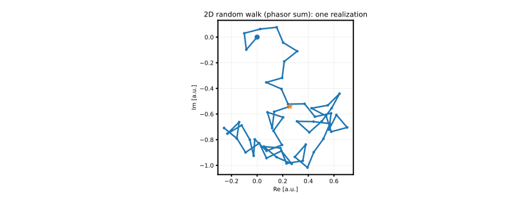
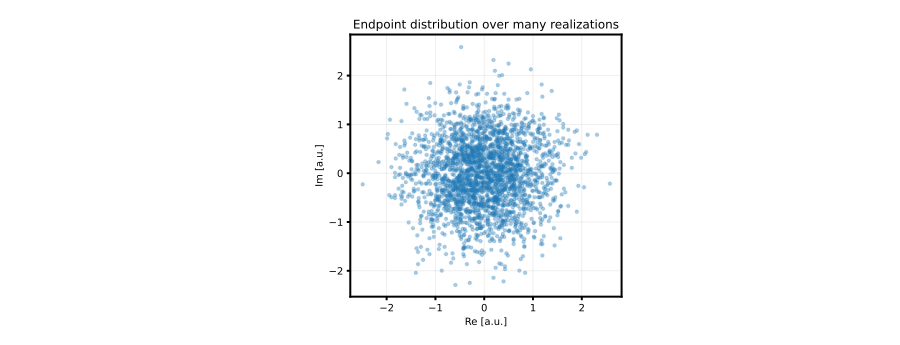
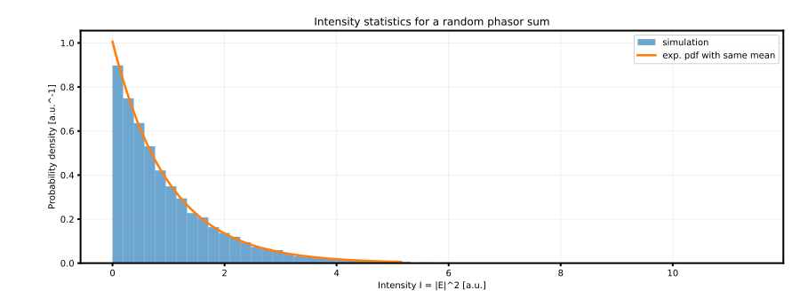
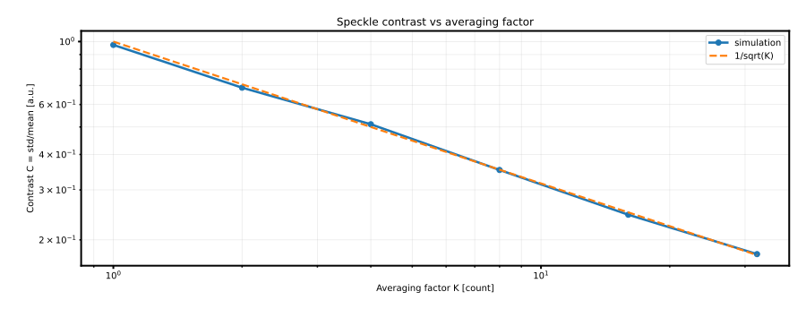

<!--
AUTO-GENERATED FILE. DO NOT EDIT DIRECTLY.
Source: notebooks/15_phasor_random_walk_toy_model.py
Generated by: scripts/export_notebooks_markdown.py
-->

# Phasor sum as a 2D random walk (toy model)

This notebook is a **reference point** for the core intuition behind many speckle / coherence discussions:

> A complex field can often be modeled (locally) as a **sum of many phasors** with different phases.

Write the complex field as:

$$
E = \sum_{n=1}^{N} a_n\exp(i\phi_n),
$$

which is equivalent to a **head-to-tail 2D random walk** in the complex plane:

- each step is a complex vector $a_n\exp(i\phi_n)$
- the endpoint is the phasor sum $E$
- the (instantaneous) intensity is:

$$
I = |E|^2.
$$

This notebook has two goals:

1. Provide a **clean toy model** with a few "obvious" knobs (number of phasors, weights, phase bias / correlation).
2. Keep a set of **canonical figures** (committed SVGs) so the GitHub Markdown mirror is readable.

---

## Canonical figures (SVG, committed)

These are generated by:

```bash
python scripts/generate_phasor_random_walk_figures.py
```









## 0) Imports + repo plumbing

<details>
<summary>Code cell 1</summary>

```python
from __future__ import annotations

import sys
from pathlib import Path

import matplotlib
import matplotlib.pyplot as plt
import numpy as np

if "ipykernel" in sys.modules:
    try:
        if matplotlib.get_backend().lower() == "agg":
            matplotlib.use("module://matplotlib_inline.backend_inline", force=True)
    except Exception:
        pass


def find_repo_root(start: Path) -> Path:
    """Find repo root by walking upward until we see (src/, environment.yml)."""

    p = start.resolve()
    for parent in [p, *p.parents]:
        if (parent / "src").is_dir() and (parent / "environment.yml").exists():
            return parent
    return p


REPO_ROOT = find_repo_root(Path.cwd())
if str(REPO_ROOT) not in sys.path:
    sys.path.insert(0, str(REPO_ROOT))

from src.phasor_random_walk import (  # noqa: E402
    average_over_k_uncorrelated,
    simulate_ensemble,
    simulate_walk,
    speckle_contrast_1d,
)
```

</details>

## 1) "Obvious knobs" (edit these)

In this toy model there are three main degrees of freedom:

- **How many phasors** do you add? ($N$)
- **How are they weighted?** (amplitudes $a_n$)
- **How random are the phases?** (angles $\phi_n$)

The defaults below correspond to a "fully random" phasor sum:

- equal amplitudes
- i.i.d. uniform phases on $[0,2\pi)$

For comparability, we normalize the amplitudes so that:

$$
\sum_n |a_n|^2 = 1.
$$

<details>
<summary>Code cell 2</summary>

```python
# Primary knobs
N = 60  # number of phasors / walk steps
M = 3000  # ensemble size for endpoint/intensity statistics
SEED = 0

amplitude_model = "equal"  # equal | uniform | lognormal | one_dominant
phase_model = "uniform"  # uniform | vonmises | correlated_gaussian

# Secondary knobs (only used for some models)
dominant_ratio = 10.0  # for amplitude_model="one_dominant"
kappa = 3.0  # for phase_model="vonmises" (0 -> uniform)
step_sigma_rad = 0.35  # for phase_model="correlated_gaussian" (0 -> straight line)
```

</details>

## 2) One walk: head-to-tail path in the complex plane

<details>
<summary>Code cell 3</summary>

```python
# A single realization (head-to-tail path)
walk = simulate_walk(
    n_steps=N,
    amplitude_model=amplitude_model,
    phase_model=phase_model,
    seed=SEED,
    dominant_ratio=dominant_ratio,
    kappa=kappa,
    step_sigma_rad=step_sigma_rad,
)

plt.rcParams.update(
    {
        "font.family": "sans-serif",
        "axes.linewidth": 2.0,
        "lines.linewidth": 2.6,
        "xtick.major.width": 2.0,
        "ytick.major.width": 2.0,
    }
)

fig, ax = plt.subplots(figsize=(6, 6))
ax.plot(walk.path.real, walk.path.imag, marker="o", markersize=3.5)
ax.scatter([0.0], [0.0], s=70, marker="o", zorder=4)
ax.scatter([walk.endpoint.real], [walk.endpoint.imag], s=120, marker="*", zorder=5)

ax.set_aspect("equal", adjustable="box")
ax.grid(True, alpha=0.25)
ax.set_title(f"One 2D walk (N={N})  |  I=|E|^2={walk.intensity:.3f}")
ax.set_xlabel("Re [a.u.]")
ax.set_ylabel("Im [a.u.]")
plt.show()
```

</details>

## 3) Ensemble: endpoint scatter + intensity histogram

<details>
<summary>Code cell 4</summary>

```python
endpoints, intensities = simulate_ensemble(
    n_steps=N,
    n_realizations=M,
    amplitude_model=amplitude_model,
    phase_model=phase_model,
    seed=SEED,
    dominant_ratio=dominant_ratio,
    kappa=kappa,
    step_sigma_rad=step_sigma_rad,
)

# Endpoint scatter
fig, ax = plt.subplots(figsize=(6, 6))
ax.scatter(endpoints.real, endpoints.imag, s=10, alpha=0.35)
ax.set_aspect("equal", adjustable="box")
ax.grid(True, alpha=0.25)
ax.set_title(f"Endpoint distribution (M={M})")
ax.set_xlabel("Re [a.u.]")
ax.set_ylabel("Im [a.u.]")
plt.show()

# Intensity histogram
fig, ax = plt.subplots(figsize=(7, 4))
ax.hist(intensities, bins=60, density=True, alpha=0.65, label="simulation")
mu = float(np.mean(intensities))
x = np.linspace(0.0, float(np.quantile(intensities, 0.995)), 500)
ax.plot(x, (1.0 / mu) * np.exp(-x / mu), label="exp. pdf with same mean")
ax.grid(True, alpha=0.25)
ax.set_title(f"Intensity I=|E|^2 (mean={mu:.3f})")
ax.set_xlabel("Intensity I [a.u.]")
ax.set_ylabel("Probability density [a.u.^-1]")
ax.legend(framealpha=0.9)
plt.show()
```

</details>

## 4) Averaging: how contrast shrinks with $K$

If you average $K$ **independent** intensity realizations:

$$
I_K = \frac{1}{K}\sum_{j=1}^{K} I_j,
$$

then the speckle contrast typically scales like:

$$
C_K \sim \frac{1}{\sqrt{K}}.
$$

Here we estimate contrast empirically with:

$$
C = \frac{\mathrm{std}(I)}{\langle I\rangle}.
$$

<details>
<summary>Code cell 5</summary>

```python
k_list = np.array([1, 2, 4, 8, 16, 32], dtype=int)
m_avg = 2000  # averaged samples per K

C = []
for k in k_list:
    # generate m_avg*k independent samples, then group-average
    _, I = simulate_ensemble(
        n_steps=N,
        n_realizations=int(m_avg * k),
        amplitude_model=amplitude_model,
        phase_model=phase_model,
        seed=int(SEED + 1000 + k),
        dominant_ratio=dominant_ratio,
        kappa=kappa,
        step_sigma_rad=step_sigma_rad,
    )
    I_k = average_over_k_uncorrelated(I, k=int(k))
    C.append(speckle_contrast_1d(I_k))

C = np.asarray(C, dtype=float)

fig, ax = plt.subplots(figsize=(7, 4))
ax.plot(k_list, C, marker="o", label="simulation")
ax.plot(k_list, 1.0 / np.sqrt(k_list), linestyle="--", label="1/sqrt(K)")

ax.set_xscale("log")
ax.set_yscale("log")
ax.grid(True, which="both", alpha=0.25)
ax.set_title("Speckle contrast vs averaging factor")
ax.set_xlabel("Averaging factor K [count]")
ax.set_ylabel("Contrast C [a.u.]")
ax.legend(framealpha=0.9)
plt.show()
```

</details>

## 5) Bridge to the "slide-type" instantaneous phasor deck model

The random-walk toy model above is deliberately generic: it is just a sum of phasors.

If you want to connect this directly to the instantaneous-deck pictures (comb lines × discrete paths),
run:

```bash
python scripts/phasor_slidertype_animation.py \
  --N_wl 20 --T_ps 160 --dt_ps 1 \
  --deltaL_mm 0,25,51 \
  --outdir reports/phasor_slides_60phasors \
  --make_gif --fps 25
```

That script produces:

- `reports/phasor_slides_60phasors/frame_0000_...png`, ... (slide browsing)
- `reports/phasor_slides_60phasors/phasor_slides.gif` (optional)

The physics used by that script lives in:

- `src/instantaneous_phasor_sum.py`

so you can reuse it from notebooks/tests without copying code.
