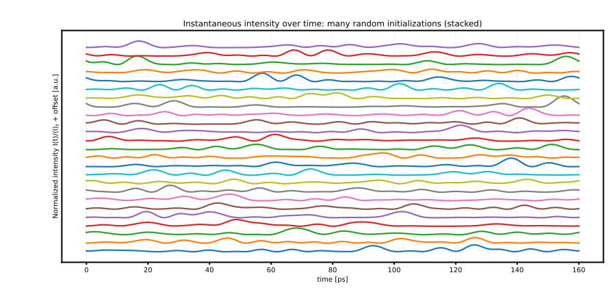
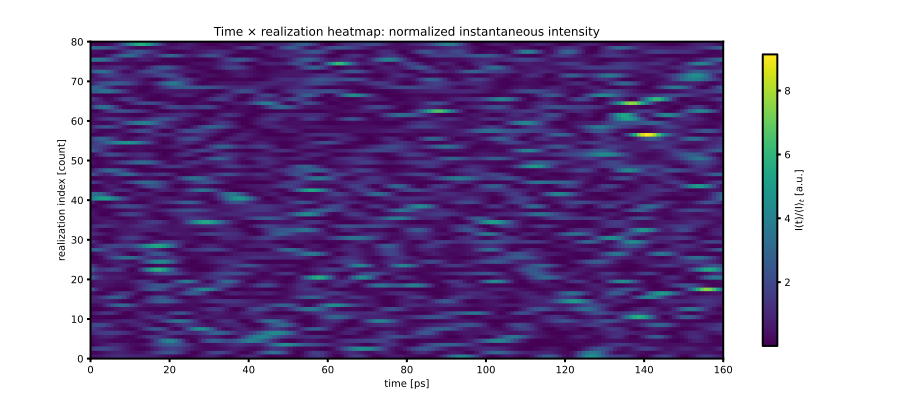
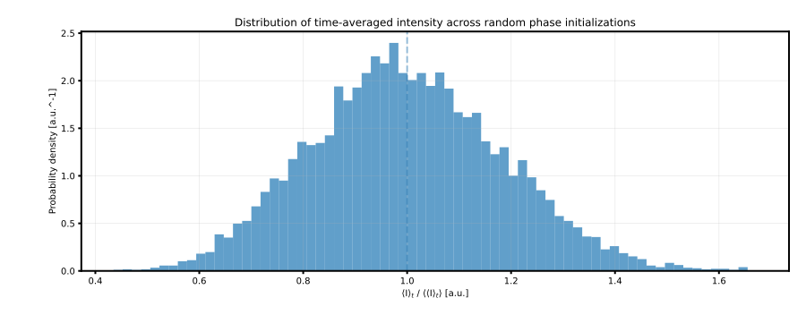

<!--
AUTO-GENERATED FILE. DO NOT EDIT DIRECTLY.
Source: notebooks/16_instantaneous_intensity_time_traces.py
Generated by: scripts/export_notebooks_markdown.py
-->

# Instantaneous intensity vs time (comb × discrete paths toy model)

This notebook is a **reference point** for a common “one pixel” question:

> If a pixel’s complex field is a sum of many phasors, what does its **instantaneous intensity** $I(t)$ look like over time,
> and how much does the **time-average** vary from pixel to pixel?

We use the **instantaneous phasor-sum toy model** (frequency comb × discrete paths):

$$
E_{k,p}(t)=A\exp\left\{ i\left[2\pi(f_k-f_{\mathrm{ref}})t - 2\pi f_k\tau_p + \phi_{k,p}\right] \right\},
$$

$$
E(t)=\sum_{k,p}E_{k,p}(t),\qquad I(t)=|E(t)|^2.
$$

In this picture, each “pixel” is modeled as a **different random set of fixed phases** $\phi_{k,p}$ (one draw per $(k,p)$),
representing unknown static phases at that pixel.

We focus on a baseline configuration used throughout the repo’s “instantaneous phasor deck”:

- $N_{\lambda}=20$ wavelengths (comb lines)
- $N_{\mathrm{paths}}=3$ discrete paths with $\Delta L = (0,25,51)\thinspace\mathrm{mm}$
- a $T=160\thinspace\mathrm{ps}$ window, with adjacent comb spacing $\Delta f = 1/T$

---

## Canonical figures (SVG, committed)

These are generated by:

```bash
python scripts/generate_instantaneous_intensity_figures.py
```







## 0) Imports + repo plumbing

<details>
<summary>Code cell 1</summary>

```python
from __future__ import annotations

import sys
from dataclasses import replace
from pathlib import Path

import matplotlib
import matplotlib.pyplot as plt
import numpy as np

if "ipykernel" in sys.modules:
    try:
        if matplotlib.get_backend().lower() == "agg":
            matplotlib.use("module://matplotlib_inline.backend_inline", force=True)
    except Exception:
        pass


def find_repo_root(start: Path) -> Path:
    """Find repo root by walking upward until we see (src/, environment.yml)."""

    p = start.resolve()
    for parent in [p, *p.parents]:
        if (parent / "src").is_dir() and (parent / "environment.yml").exists():
            return parent
    return p


REPO_ROOT = find_repo_root(Path.cwd())
if str(REPO_ROOT) not in sys.path:
    sys.path.insert(0, str(REPO_ROOT))

from src.instantaneous_phasor_sum import (  # noqa: E402
    InstantaneousPhasorSumConfig,
    compute_phasors,
    time_average_intensity_analytic,
    time_average_intensity_numeric,
)
```

</details>

## 1) Baseline configuration (“3 paths × 20 wavelengths”, 0–160 ps)

The key knob for “pixel-to-pixel randomness” in this toy model is:

- `add_random_initial_phase=True` (random fixed phases $\phi_{k,p}$)
- different pixels correspond to different `seed` values.

<details>
<summary>Code cell 2</summary>

```python
cfg_base = InstantaneousPhasorSumConfig(
    lambda0_nm=640.0,
    n_wavelengths=20,
    T_ps=160.0,
    dt_ps=1.0,
    deltaL_mm=(0.0, 25.0, 51.0),
    path_amp="equal_power",
    ref="lowest",
    order="by_wavelength",
    seed=0,
    add_random_initial_phase=True,
)
```

</details>

## 2) One realization: $I(t)$ over the full window

Notes:

- The implementation includes both endpoints $t=0$ and $t=T$ (so the “last frame” is explicit).
- For this comb choice, the field repeats after $T$, so $I(0)=I(T)$.
- When computing a discrete mean, it’s usually better to average over $[0,T)$ (drop the final sample).

<details>
<summary>Code cell 3</summary>

```python
out = compute_phasors(cfg_base)

I = out.intensity
I_mean_numeric = time_average_intensity_numeric(out, exclude_endpoint=True)
I_mean_analytic = time_average_intensity_analytic(cfg_base)

fig, ax = plt.subplots(figsize=(12.5, 4.2))
ax.plot(out.times_ps, I, linewidth=2.6)
ax.grid(True, alpha=0.25)
ax.set_title("Instantaneous intensity for one random phase initialization")
ax.set_xlabel("time [ps]")
ax.set_ylabel("Intensity I(t) = |E(t)|^2 [a.u.]")
ax.text(
    0.02,
    0.96,
    f"mean over [0,T) = {I_mean_numeric:.3g}\nanalytic mean = {I_mean_analytic:.3g}",
    transform=ax.transAxes,
    ha="left",
    va="top",
    fontsize=11,
)
for spine in ax.spines.values():
    spine.set_linewidth(2.0)

plt.show()
```

</details>

## 3) Many realizations: stacked $I(t)$ traces (default “spaghetti but readable”)

A good default view is to normalize each trace by its own time-mean:

$$
\tilde I(t) = \frac{I(t)}{\langle I\rangle_t},
$$

then stack the traces vertically (purely for readability).

For a cleaner “dense” view, see the heatmap in the next section.

<details>
<summary>Code cell 4</summary>

```python
n_traces = 25
outs = [compute_phasors(replace(cfg_base, seed=int(cfg_base.seed + i))) for i in range(n_traces)]

times_ps = outs[0].times_ps
I_stack = []
for o in outs:
    mu = time_average_intensity_numeric(o, exclude_endpoint=True)
    I_stack.append(o.intensity / mu)
I_stack = np.asarray(I_stack)

y_max = float(np.quantile(I_stack, 0.995))
spacing = 1.15 * y_max

fig, ax = plt.subplots(figsize=(12.5, 6.0))
for i in range(n_traces):
    ax.plot(times_ps, I_stack[i] + i * spacing, linewidth=2.2)

ax.grid(True, alpha=0.22)
ax.set_title("Instantaneous intensity over time: many random initializations (stacked)")
ax.set_xlabel("time [ps]")
ax.set_ylabel("Normalized intensity I(t)/⟨I⟩$_t$ + offset [a.u.]")
ax.set_yticks([])
for spine in ax.spines.values():
    spine.set_linewidth(2.0)

plt.show()
```

</details>

## 4) Many realizations: time × realization heatmap (often clearer)

This compresses many realizations into one plot:

- x-axis: time
- y-axis: realization index (“pixel index”)
- color: normalized intensity $I(t)/\langle I\rangle_t$

If you increase `n_heat` to a few hundred, this becomes a fast “what does the ensemble look like?” diagnostic.

<details>
<summary>Code cell 5</summary>

```python
n_heat = 80
outs_h = [compute_phasors(replace(cfg_base, seed=int(cfg_base.seed + i))) for i in range(n_heat)]

I_heat = []
for o in outs_h:
    mu = time_average_intensity_numeric(o, exclude_endpoint=True)
    I_heat.append(o.intensity / mu)
I_heat = np.asarray(I_heat)

fig, ax = plt.subplots(figsize=(12.5, 5.4))
im = ax.imshow(
    I_heat,
    aspect="auto",
    origin="lower",
    extent=(float(times_ps[0]), float(times_ps[-1]), 0, n_heat),
)

ax.set_title("Time × realization heatmap: normalized instantaneous intensity")
ax.set_xlabel("time [ps]")
ax.set_ylabel("realization index [count]")

cbar = fig.colorbar(im, ax=ax, shrink=0.92)
cbar.set_label("I(t)/⟨I⟩$_t$ [a.u.]")
for spine in ax.spines.values():
    spine.set_linewidth(2.0)

plt.show()
```

</details>

## 5) Histogram: distribution of time-averaged intensity across many “pixels”

For each realization (each random phase initialization) define the window-average:

$$
\langle I\rangle_t = \frac{1}{T}\int_0^T I(t)\,\mathrm{d}t.
$$

For this comb choice (adjacent spacing $\Delta f = 1/T$), the average simplifies to:

$$
\langle I\rangle_t
= \sum_k \left|\sum_p A\exp\left(-i2\pi f_k\tau_p + i\phi_{k,p}\right)\right|^2.
$$

This closed form is implemented in `time_average_intensity_analytic`, which is fast enough to sample thousands of
random initializations.

<details>
<summary>Code cell 6</summary>

```python
n_hist = 10000
means = np.array(
    [time_average_intensity_analytic(replace(cfg_base, seed=int(cfg_base.seed + i))) for i in range(n_hist)],
    dtype=float,
)
mu = float(np.mean(means))
x = means / mu

fig, ax = plt.subplots(figsize=(12.5, 4.8))
ax.hist(x, bins=70, density=True, alpha=0.70)
ax.axvline(1.0, linestyle="--", linewidth=2.0, alpha=0.45)
ax.grid(True, alpha=0.25)
ax.set_title("Distribution of time-averaged intensity across random phase initializations")
ax.set_xlabel("⟨I⟩$_t$ / ⟨⟨I⟩$_t$⟩ [a.u.]")
ax.set_ylabel("Probability density [a.u.^-1]")
for spine in ax.spines.values():
    spine.set_linewidth(2.0)

plt.show()
```

</details>
